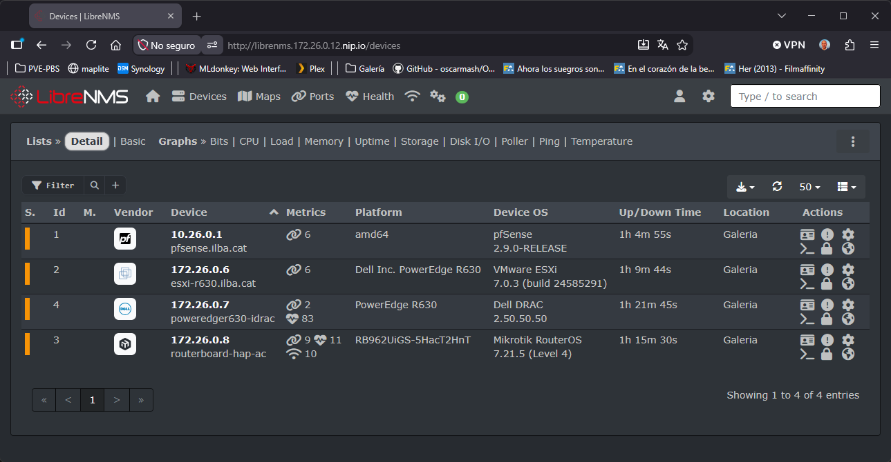

```
[root@bastion ~]# helm repo add librenms https://www.librenms.org/helm-charts
[root@bastion ~]# helm repo update
[root@bastion ~]# oc new-project ilba-librenms --description="LibreNMS is an autodiscovering network monitoring system" --display-name="LibreNMS"
```

Para evitar que la API de Kubernetes/OKD lance advertencias al aplicar manifiestos en este namespace, relaja el nivel de auditoría de Pod Security en el proyecto:
* warn=privileged: ontrola cuándo la API de Kubernetes/OKD muestra advertencias visuales (warnings) en la consola al aplicar manifiestos.
* audit=privileged: evita que el clúster llene los registros de auditoría, ya que le hemos dicho: "warn=privileged".

```
oc label namespace ilba-librenms \
  pod-security.kubernetes.io/warn=privileged \
  pod-security.kubernetes.io/audit=privileged \
  --overwrite
```

En OKD / OpenShift, la seguridad de ejecución de los contenedores está gobernada por los Security Context Constraints (SCC). A diferencia de Kubernetes estándar, OKD no permite por defecto que los contenedores se ejecuten como usuarios fijos de Linux (root o UIDs del sistema).
* anyuid: es para que el pod de la base de datos (MySQL / MariaDB) pudiera crearse y arrancar
* privileged: es para resolver el envío de paquetes ICMP (ping) en los pods de LibreNMS

```
oc adm policy add-scc-to-user anyuid -z default -n ilba-librenms
oc adm policy add-scc-to-user privileged -z default -n ilba-librenms
```

```
[root@bastion ~]# vim manifest/values-librenms.yaml
librenms:
  timezone: Europe/Madrid
  privileged: true
ingress:
  enabled: true
  className: "openshift-default"
  hosts:
    - host: librenms.172.26.0.12.nip.io
      paths:
        - path: /
          pathType: ImplementationSpecific
  tls: []
```

```
helm upgrade --install \
librenms librenms/librenms \
--namespace ilba-librenms \
--version=10.1.1 \
-f manifest/values-librenms.yaml
```

```
[root@bastion ~]# oc -n ilba-librenms get ingress
NAME       CLASS               HOSTS                         ADDRESS                            PORTS   AGE
librenms   openshift-default   librenms.172.26.0.12.nip.io   router-default.apps.okd.ilba.cat   80      4m21s
```

Datos de acceso:
* URL: http://librenms.172.26.0.12.nip.io/
* Username: admin
* Password: 6owOmacNisGryctIns2
* Email: oscarmash@gmail.com





Validaciones:

```
[root@bastion ~]# oc exec -it librenms-poller-0 -n ilba-librenms -- ping -c 2 172.26.0.6
```