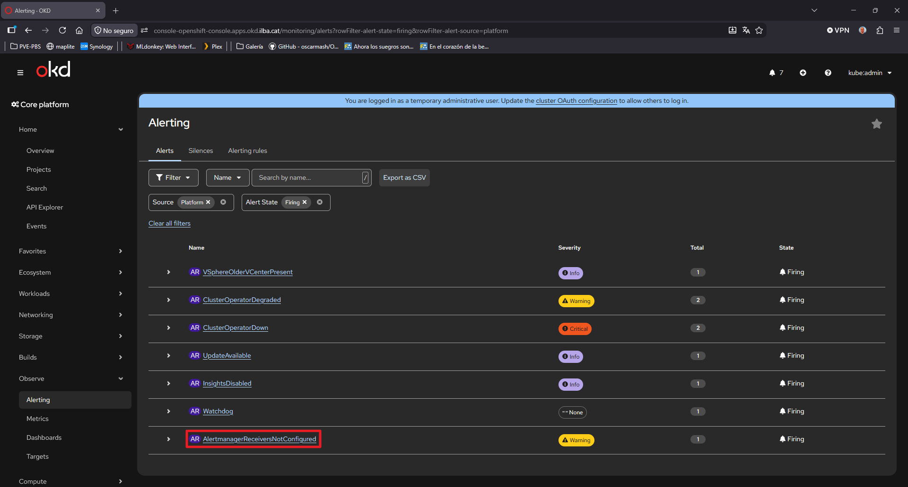

# AlertmanagerReceiversNotConfigured

* [AlertmanagerReceiversNotConfigured](#alertmanagerreceiversnotconfigured)
  * [Relay SMTP](#relay-smtp)
  * [Configuración de Alertmanager](#configuración-de-alertmanager)
  * [Validacion](#validacion)

En el Dashboard de la consola GUI de OKD, podemos ver el siguiente mensajes: **"AlertmanagerReceiversNotConfigured"**



Para solucionarlo hemos de:

* Tener un sistema de relay
* Configurar alertmanager

## Relay SMTP

Configuraremos nuestro Alermanager, para que envie alertas a un servidor SMTP, pero antes hemos de configurar nuestro relay SMTP:

```
[root@bastion ~]# dnf install postfix telnet cyrus-sasl cyrus-sasl-plain -y
[root@bastion ~]# systemctl enable --now postfix
```

```
[root@bastion ~]# vim /etc/postfix/main.cf

myhostname = relay.ilba.cat
mydomain = ilba.cat
inet_interfaces = all
mynetworks = 127.0.0.0/8, 10.26.0.0/24
relayhost = [smtp.gmail.com]:587

smtp_use_tls = yes
smtp_sasl_auth_enable = yes
smtp_sasl_password_maps = hash:/etc/postfix/sasl_passwd
smtp_sasl_security_options = noanonymous
smtp_tls_security_level = encrypt
smtp_tls_CAfile = /etc/ssl/certs/ca-bundle.crt
```

```
[root@bastion ~]# vim /etc/postfix/sasl_passwd
[smtp.gmail.com]:587 oscarmash@gmail.com:xxxx_xxxxx
```

```
[root@bastion ~]# postmap /etc/postfix/sasl_passwd
[root@bastion ~]# chmod 600 /etc/postfix/sasl_passwd /etc/postfix/sasl_passwd.db
[root@bastion ~]# systemctl restart postfix
```

Verificaremos por telnet que funciona:

```
[root@bastion ~]# tail -f /var/log/maillog
Aug 29 09:48:57 bastion postfix/smtp[12659]: 4C1EC20651AA: to=<oscarmash@gmail.com>, relay=smtp.gmail.com[74.125.133.109]:587, delay=572, delays=570/0.06/0.45/0.75, dsn=2.0.0, status=sent (250 2.0.0 OK  1787989737 5b1f17b1804b1-49ccae954f9sm49810175e9.13 - gsmtp)
Aug 29 09:48:57 bastion postfix/qmgr[12657]: 4C1EC20651AA: removed
```

## Configuración de Alertmanager

```
[root@bastion ~]# vim manifest/cluster-alertmanager-patch.yaml
apiVersion: monitoring.coreos.com/v1
kind: Alertmanager
metadata:
  name: main
  namespace: openshift-monitoring
spec:
  config:
    global:
      smtp_smarthost: '10.26.0.5:25'
      smtp_from: 'alertmanager-okd@ilba.cat'
      smtp_require_tls: false
    route:
      receiver: 'Default'
      group_by: ['alertname', 'namespace']
      group_wait: 30s
      group_interval: 5m
      repeat_interval: 12h
      routes:
      - match:
          severity: critical
        receiver: 'Critical'
    receivers:
    - name: 'Default'
      email_configs:
      - to: 'oscarmash@gmail.com'
        send_resolved: true
    - name: 'Critical'
      email_configs:
      - to: 'oscarmash@gmail.com'
        send_resolved: true
    - name: 'Watchdog'

[root@bastion ~]# oc apply -f manifest/cluster-alertmanager-patch.yaml
[root@bastion ~]# oc delete pod -n openshift-monitoring -l app.kubernetes.io/name=alertmanager
```

```
[root@bastion ~]# vim manifest/alertmanager.yaml
global:
  resolve_timeout: 5m
  smtp_smarthost: '10.26.0.5:25'
  smtp_from: 'alertmanager-okd@ilba.cat'
  smtp_require_tls: false

route:
  group_by: ['alertname', 'namespace']
  group_wait: 30s
  group_interval: 5m
  repeat_interval: 12h
  receiver: 'Default'
  routes:
  - match:
      severity: critical
    receiver: 'Critical'

receivers:
- name: 'Default'
  email_configs:
  - to: 'oscarmash@gmail.com'
    send_resolved: true
- name: 'Critical'
  email_configs:
  - to: 'oscarmash@gmail.com'
    send_resolved: true
- name: 'Watchdog'

[root@bastion ~]# cd manifest/
[root@bastion manifest]# oc create secret generic alertmanager-main-config \
  --from-file=alertmanager.yaml=alertmanager.yaml \
  -n openshift-monitoring \
  --dry-run=client -o yaml | oc apply -f -

[root@bastion manifest]# vim patch-alertmanager-secret.yaml
apiVersion: monitoring.coreos.com/v1
kind: Alertmanager
metadata:
  name: main
  namespace: openshift-monitoring
spec:
  configSecret: alertmanager-main-config

[root@bastion manifest]# oc apply -f patch-alertmanager-secret.yaml
[root@bastion manifest]# oc delete pod -n openshift-monitoring -l app.kubernetes.io/name=alertmanager
```

## Validacion

```
[root@bastion ~]# vim manifest/test-alert.yaml
apiVersion: monitoring.coreos.com/v1
kind: PrometheusRule
metadata:
  name: test-email-alert
  namespace: openshift-monitoring
spec:
  groups:
  - name: test.rules
    rules:
    - alert: TestEmailNotification
      expr: vector(1) > 0
      for: 0m
      labels:
        severity: critical
      annotations:
        summary: "Alerta de prueba para validar el correo de OpenShift"
        description: "Si recibes este correo, el relay SMTP y Alertmanager funcionan correctamente."

[root@bastion ~]# oc apply -f manifest/test-alert.yaml && tail -f /var/log/maillog
[root@bastion ~]# oc delete -f manifest/test-alert.yaml
```