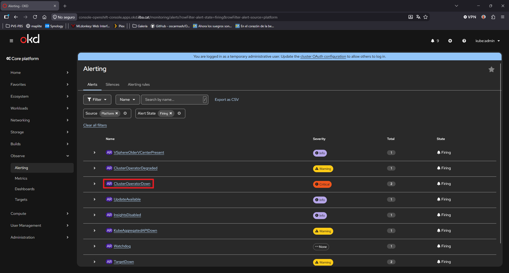

# ClusterOperatorDown

En el Dashboard de la consola GUI de OKD, podemos ver el siguiente mensajes: **"ClusterOperatorDown"**



## ERROR 1 (monitoring)

```
[root@bastion ~]# oc get clusteroperators
NAME                                       VERSION             AVAILABLE   PROGRESSING   DEGRADED   SINCE   MESSAGE
...
monitoring                                 4.21.0-okd-scos.9   False       True          True       9m39s   UpdatingMetricsServer: reconciling MetricsServer Deployment failed: updating Deployment object failed: waiting for DeploymentRollout of openshift-monitoring/metrics-server: context deadline exceeded: the number of pods targeted by the deployment (3 pods) is different from the number of pods targeted by the deployment that have the desired template spec (2 pods)
...
```

```
[root@bastion ~]# oc get pods -n openshift-monitoring -l app.kubernetes.io/name=metrics-server
NAME                              READY   STATUS    RESTARTS   AGE
metrics-server-55c794d86b-jx6h9   0/1     Running   0          113s
metrics-server-55c794d86b-zbb8x   0/1     Running   0          113s
```

```
[root@bastion ~]# oc logs metrics-server-55c794d86b-jx6h9 -n openshift-monitoring -c metrics-server --tail=100
Error from server: Get "https://10.26.0.23:10250/containerLogs/openshift-monitoring/metrics-server-55c794d86b-jx6h9/metrics-server?tailLines=100": remote error: tls: internal error

[root@bastion ~]# oc adm node-logs --role=worker --path=kubelet/kubelet.log
error: error trying to reach service: remote error: tls: internal error
```

```
[root@bastion ~]# for csr in $(oc get csr --no-headers | grep Pending | awk '{print $1}'); do oc adm certificate approve $csr; done
```

Pasados unos minutos:

```
[root@bastion ~]# oc get clusteroperators
...
monitoring                                 4.21.0-okd-scos.9   True        False         False      13s
...
```

## ERROR 2