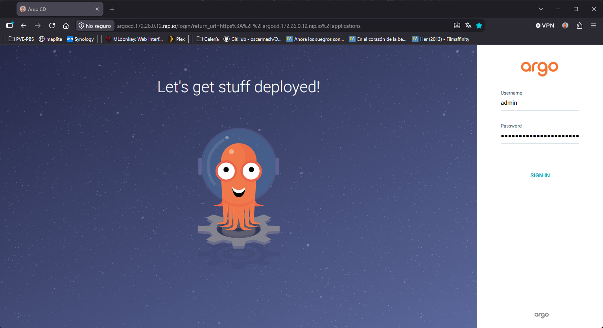

# Arquitectura y flujo

OKD / OpenShift divide el ciclo de CI (Integración Continua) y CD (Despliegue Continuo / GitOps) en dos herramientas distintas y complementarias:

* CD: Argo CD (OpenShift GitOps)
* CI: Tekton (OpenShift Pipelines)

Resumen del flujo de trabajo estándar en OKD (CI/CD)

```
┌──────────────────┐
│  Repositorio Git │ (Código fuente)
└────────┬─────────┘
         │
         ▼ 1. Push / Webhook
┌─────────────────────────────────────────────────────────┐
│              CI: Tekton (OpenShift Pipelines)           │
│  - Ejecuta pruebas (Tests / Linting)                    │
│  - Compila y construye la imagen (Build)                │
│  - Publica imagen en Registry (Quay / Registry interno) │
│  - Actualiza tag/versión en repositorio Git de Manifiestos
└────────────────────────┬────────────────────────────────┘
                         │
                         ▼ 2. Commit / Sync
┌─────────────────────────────────────────────────────────┐
│               CD: Argo CD (OpenShift GitOps)            │
│  - Detecta cambios en el repo Git de manifiestos/Helm   │
│  - Compara estado deseado (Git) vs actual (Clúster)    │
│  - Aplica y reconcilia los cambios de forma automática   │
└────────────────────────┬────────────────────────────────┘
                         │
                         ▼ 3. Despliegue declarativo
┌─────────────────────────────────────────────────────────┐
│                    Clúster OKD                          │
│  - Actualiza Deployments, Services, Routes, etc.        │
│  - Pone en marcha las nuevas versiones de la aplicación │
└─────────────────────────────────────────────────────────┘
```

# Despliegue de Argo CD con OLM

Despliegue de OpenShift GitOps (Argo CD) en OKD mediante OLM (Operator Lifecycle Manager)

```
[root@bastion ~]# oc get packagemanifest -n openshift-marketplace | grep -E "gitops|argocd"
argocd-operator                             Community Operators   3d4h

[root@bastion ~]# oc get packagemanifest argocd-operator -n openshift-marketplace -o jsonpath='{.status.defaultChannel}'
alpha

[root@bastion ~]# kubectl get packagemanifest argocd-operator -o jsonpath='{range .status.channels[*].entries[*]}{.name}{"\n"}{end}' | head -n 3
argocd-operator.v0.18.0
argocd-operator.v0.17.0
argocd-operator.v0.16.0
```

```
[root@bastion ~]# vim manifest/install-argocd-operator.yaml
apiVersion: v1
kind: Namespace
metadata:
  name: argocd-operator
  labels:
    openshift.io/cluster-monitoring: "true"
---
apiVersion: operators.coreos.com/v1
kind: OperatorGroup
metadata:
  name: argocd-operator-group
  namespace: argocd-operator
spec:
  upgradeStrategy: Default
---
apiVersion: operators.coreos.com/v1alpha1
kind: Subscription
metadata:
  name: argocd-operator
  namespace: argocd-operator
spec:
  channel: alpha
  installPlanApproval: Manual
  name: argocd-operator
  source: community-operators
  sourceNamespace: openshift-marketplace
  startingCSV: argocd-operator.v0.18.0
```

```
[root@bastion ~]# oc apply -f manifest/install-argocd-operator.yaml

[root@bastion ~]# oc get installplan -n argocd-operator
NAME            CSV                       APPROVAL   APPROVED
install-s6dsv   argocd-operator.v0.18.0   Manual     false
```

```
oc patch installplan $(oc get installplan -n argocd-operator -o jsonpath='{.items[0].metadata.name}') \
  -n argocd-operator \
  --type merge \
  -p '{"spec":{"approved":true}}'
```

```
[root@bastion ~]# oc get installplan -n argocd-operator
NAME            CSV                       APPROVAL   APPROVED
install-s6dsv   argocd-operator.v0.18.0   Manual     true

[root@bastion ~]# oc get csv -n argocd-operator
NAME                      DISPLAY   VERSION   REPLACES                  PHASE
argocd-operator.v0.18.0   Argo CD   0.18.0    argocd-operator.v0.17.0   Succeeded

[root@bastion ~]# oc get pods -n argocd-operator
NAME                                                  READY   STATUS    RESTARTS   AGE
argocd-operator-controller-manager-84896b9795-h6b57   1/1     Running   2          3d15h
```

Crearemos un ArgoCD en el NS: ilba-argocd

```
[root@bastion ~]# oc create namespace ilba-argocd

[root@bastion ~]# vim manifest/argocd-instance.yaml
apiVersion: argoproj.io/v1beta1
kind: ArgoCD
metadata:
  name: argocd
  namespace: ilba-argocd
spec:
  server:
    host: argocd.172.26.0.12.nip.io
    route:
      enabled: true
      tls:
        termination: reencrypt
  sso:
    provider: dex
    dex:
      openShiftOAuth: true

[root@bastion ~]# oc apply -f manifest/argocd-instance.yaml

[root@bastion ~]# oc get pods -n ilba-argocd
NAME                                  READY   STATUS    RESTARTS   AGE
argocd-application-controller-0       1/1     Running   0          54s
argocd-dex-server-57f68777d7-wtf4l    1/1     Running   0          53s
argocd-redis-55b7b56f9c-fjpm6         1/1     Running   0          54s
argocd-repo-server-6bfb95d7b4-wg6gt   1/1     Running   0          54s
argocd-server-d8fd7fd9d-s6sx5         1/1     Running   0          54s

[root@bastion ~]# oc get route argocd-server -n ilba-argocd
NAME            HOST/PORT                   PATH   SERVICES        PORT    TERMINATION   WILDCARD
argocd-server   argocd.172.26.0.12.nip.io          argocd-server   https   reencrypt     None

[root@bastion ~]# oc extract secret/argocd-cluster -n ilba-argocd --to=- --keys=admin.password
# admin.password
GPHfi5NdKjzMoCmyuEa8lqct6ngFQ34b
```

Acceso:
* URL: https://argocd.172.26.0.12.nip.io/
* Username: admin
* Password: GPHfi5NdKjzMoCmyuEa8lqct6ngFQ34b


