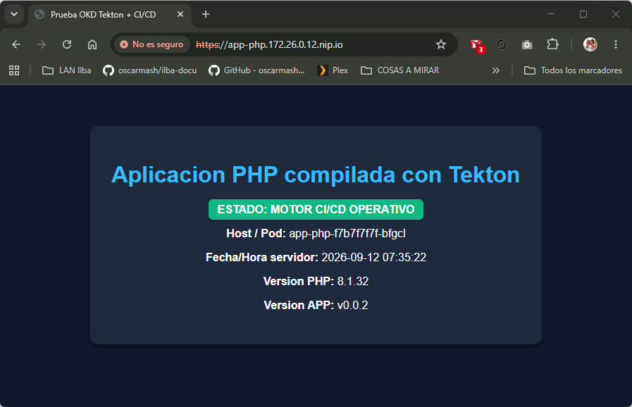
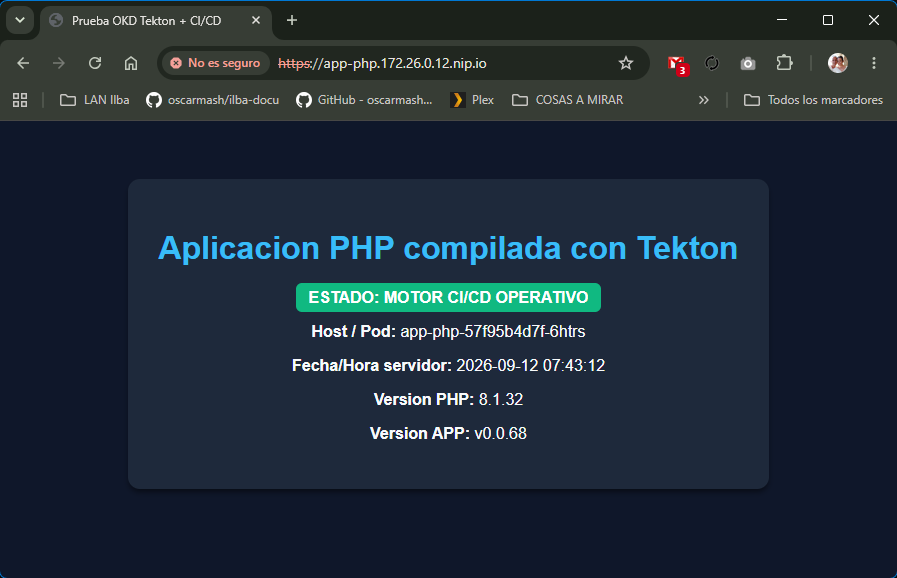

## Índice

* [Instalación de Tekton](#instalación-de-tekton)
* [Compilación directa con código embebido (Inline Task)](#compilación-directa-con-código-embebido-inline-task)
  * [Creación del proyecto](#creación-del-proyecto)
  * [Creación de la Task](#creación-de-la-task)
  * [Lanzar el TaskRun](#lanzar-el-taskrun)
  * [Desplegar la aplicación](#desplegar-la-aplicación)
  * [Cambio de versión de la APP](#cambio-de-versión-de-la-app)
* [Pipeline CI completo con GitHub y PVC Workspace](#pipeline-ci-completo-con-github-y-pvc-workspace)

El catálogo actual (community-operators): Solo indexa los operadores de la comunidad. En ciertas versiones de OKD, la comunidad de Tekton no mantiene publicado un paquete OLM en community-operators. Vamos que que no existe ningún operador de Tekton dentro del catálogo community-operators de OKD :shit:

# Instalación de Tekton

```
[root@bastion ~]# oc get catalogsource -n openshift-marketplace
NAME                  DISPLAY               TYPE   PUBLISHER   AGE
community-operators   Community Operators   grpc   Red Hat     6d20h
```

Desplegaremos Tekton Operator del upstream directamente.

```
[root@bastion ~]# oc apply -f https://storage.googleapis.com/tekton-releases/operator/latest/release.yaml
```

```
[root@bastion ~]# oc get pods -n tekton-operator
NAME                                       READY   STATUS    RESTARTS   AGE
tekton-operator-5889466b74-m4dwt           2/2     Running   0          17s
tekton-operator-webhook-5f68fd688b-j7zg5   1/1     Running   0          17s
```

```
[root@bastion ~]# vim manifest/tekton_config.yaml
apiVersion: operator.tekton.dev/v1alpha1
kind: TektonConfig
metadata:
  name: config
spec:
  targetNamespace: openshift-pipelines
  pipeline:
    params: []
  result:
    disabled: true
  pruner:
    resources:
      - pipelinerun
      - taskrun
    keep: 3
    schedule: "0 8 * * *"
```

```
[root@bastion ~]# oc delete tektonconfig config
[root@bastion ~]# oc apply -f manifest/tekton_config.yaml
```

```
[root@bastion ~]# oc adm policy add-scc-to-user anyuid -z tekton-pipelines-controller -n openshift-pipelines
[root@bastion ~]# oc adm policy add-scc-to-user anyuid -z tekton-pipelines-webhook -n openshift-pipelines
[root@bastion ~]# oc adm policy add-scc-to-group anyuid system:serviceaccounts:openshift-pipelines
[root@bastion ~]# oc adm policy add-scc-to-group privileged system:serviceaccounts:openshift-pipelines
[root@bastion ~]# oc adm policy add-scc-to-group privileged system:serviceaccounts:tekton-operator
```

```
[root@bastion ~]# oc delete rs --all -n openshift-pipelines
[root@bastion ~]# oc rollout restart deployment/tekton-operator -n tekton-operator
```

```
[root@bastion ~]# oc get pods -n openshift-pipelines
NAME                                                READY   STATUS    RESTARTS   AGE
tekton-chains-controller-7fcf49767-8868h            1/1     Running   0          8s
tekton-events-controller-84ddbdc948-4n28v           1/1     Running   0          68s
tekton-operator-proxy-webhook-6c7dcbddf5-n7r2k      1/1     Running   0          68s
tekton-pipelines-controller-7b85df8565-gqlpg        1/1     Running   0          68s
tekton-pipelines-remote-resolvers-db6db9996-dxv5l   1/1     Running   0          68s
tekton-pipelines-webhook-7d48c76b87-lk2h4           1/1     Running   0          68s
tekton-triggers-controller-5b8b78d66-7nk82          1/1     Running   0          29s
tekton-triggers-core-interceptors-767bfd459-8s467   1/1     Running   0          29s
tekton-triggers-webhook-8579b6f968-kb5pv            1/1     Running   0          29s
```

```
[root@bastion ~]# oc get tektonpipeline
NAME       VERSION   READY   REASON
pipeline   v1.3.1    True

[root@bastion ~]# oc get tektontrigger
NAME      VERSION   READY   REASON
trigger   v0.33.0   True

[root@bastion ~]# oc get tektonchain
NAME    VERSION   READY   REASON
chain   v0.25.1   True

[root@bastion ~]# oc get tektonresult
NAME     VERSION   READY   REASON
result   v0.16.0   True
```

# Compilación directa con código embebido (Inline Task)

Antes de emepzar este paso, hemos de tener el registry de OKD (en nuestro caso) o cualquier otro registry, para poder subir las imágenes

## Creación del proyecto

Creamos el proyecto y cambiamos de contexto:

```
[root@bastion ~]# oc new-project test-build --description="Prueba CI/CD PHP con Tekton"
[root@bastion ~]# oc project test-build
```

Crear la ServiceAccount para Tekton

```
[root@bastion ~]# oc create sa pipeline -n test-build
```

Asignamos SCC privileged para Buildah y permisos de edición en el namespace

```
[root@bastion ~]# oc adm policy add-scc-to-user privileged -z pipeline -n test-build
[root@bastion ~]# oc adm policy add-role-to-user edit -z pipeline -n test-build
```

## Creación de la Task

En el recurso *kind: Task* se define cómo se hace el trabajo (los pasos lógicos, la imagen de Buildah, los scripts bash, las variables esperadas). Vamos esta es la plantilla.

La *Task* se define una sola vez en el clúster y no se toca más, a menos que cambies la lógica del script o la imagen de Buildah.

```
[root@bastion ~]# vim manifest/tekton-task.yaml
apiVersion: tekton.dev/v1
kind: Task
metadata:
  name: build-php-app
  namespace: test-build
spec:
  params:
    - name: IMAGE_TAG
      type: string
      description: "Etiqueta / versión de la aplicación"
      default: "v0.0.2"
    - name: IMAGE_NAME
      type: string
      description: "Nombre del ImageStream en OKD"
      default: "app-php"
  steps:
    - name: generate-and-build
      image: quay.io/buildah/stable:latest
      securityContext:
        privileged: true
      script: |
        #!/usr/bin/env bash
        set -e

        TAG="$(params.IMAGE_TAG)"
        NAME="$(params.IMAGE_NAME)"
        REGISTRY="image-registry.openshift-image-registry.svc:5000/test-build/${NAME}:${TAG}"

        echo "=== Iniciando compilacion de ${NAME} con tag: ${TAG} ==="

        # 1. Crear el codigo fuente PHP
        cat << PHP > index.php
        <!DOCTYPE html>
        <html>
        <head>
          <title>Prueba OKD Tekton + CI/CD</title>
          <style>
            body { font-family: sans-serif; background: #0f172a; color: #f8fafc; text-align: center; padding: 50px; }
            .card { background: #1e293b; padding: 30px; border-radius: 12px; display: inline-block; box-shadow: 0 4px 6px -1px rgba(0,0,0,0.5); }
            h1 { color: #38bdf8; }
            .badge { background: #10b981; color: white; padding: 6px 12px; border-radius: 6px; font-weight: bold; }
          </style>
        </head>
        <body>
          <div class="card">
            <h1>Aplicacion PHP compilada con Tekton</h1>
            <p><span class="badge">ESTADO: MOTOR CI/CD OPERATIVO</span></p>
            <p><strong>Host / Pod:</strong> <?php echo gethostname(); ?></p>
            <p><strong>Fecha/Hora servidor:</strong> <?php echo date('Y-m-d H:i:s'); ?></p>
            <p><strong>Version PHP:</strong> <?php echo phpversion(); ?></p>
            <p><strong>Version APP:</strong> ${TAG}</p>
          </div>
        </body>
        </html>
        PHP

        # 2. Crear el Containerfile apuntando al DocumentRoot oficial de UBI PHP
        cat << 'DOCKERFILE' > Containerfile
        FROM registry.access.redhat.com/ubi9/php-81:latest
        COPY index.php /opt/app-root/src/index.php
        COPY index.php /var/www/html/index.php
        EXPOSE 8080
        CMD ["container-entrypoint", "/usr/libexec/s2i/run"]
        DOCKERFILE

        # 3. Compilar la imagen con Buildah
        buildah bud --tls-verify=false -t "${REGISTRY}" .

        # 4. Subir la imagen al registro interno de OKD
        buildah push --tls-verify=false "${REGISTRY}"

[root@bastion ~]# oc apply -f manifest/tekton-task.yaml
```

## Lanzar el TaskRun

La Task permanece inmutable. En cada prueba solo envías el TaskRun indicando el valor deseado de la versión:

```
[root@bastion ~]# vim manifest/tekton-taskrun.yaml
apiVersion: tekton.dev/v1
kind: TaskRun
metadata:
  generateName: run-build-php-
  namespace: test-build
spec:
  serviceAccountName: pipeline
  taskRef:
    name: build-php-app
  params:
    - name: IMAGE_TAG
      value: "v0.0.2"

[root@bastion ~]# oc create -f manifest/tekton-taskrun.yaml
```

Ver los logs en tiempo real:

```
[root@bastion ~]# oc logs -n test-build -l tekton.dev/task=build-php-app -c step-generate-and-build -f
=== Iniciando compilación de app-php con tag: v0.0.1 ===
STEP 1/4: FROM registry.access.redhat.com/ubi9/php-81:latest
Trying to pull registry.access.redhat.com/ubi9/php-81:latest...
Getting image source signatures
Checking if image destination supports signatures
Copying blob sha256:187eb7a70924ad9fc4cb9f1556a54768201a4ee4e6134b8b803e8b76dd10cce0
Copying blob sha256:24431058b73728c387089e7665e6f7171089f9bc580b84b9be8d28f8923b96b6
Copying blob sha256:1a928d1cbb14019c7e27793642f2f9ab16450931ecf4d5155a4a739d1c70f06a
....
```

Verificaremos que se ha subido la imagen al registry:

```
[root@bastion ~]# oc get is -n test-build
NAME      IMAGE REPOSITORY                                 TAGS     UPDATED
app-php   registry.172.26.0.12.nip.io/test-build/app-php   v0.0.1   14 seconds ago
```

## Desplegar la aplicación

```
[[root@bastion ~]# cat manifest/tekton-app-php-deployment.yaml
apiVersion: apps/v1
kind: Deployment
metadata:
  name: app-php
  namespace: test-build
  labels:
    app: app-php
spec:
  replicas: 1
  selector:
    matchLabels:
      app: app-php
  template:
    metadata:
      labels:
        app: app-php
    spec:
      containers:
        - name: php-web
          image: image-registry.openshift-image-registry.svc:5000/test-build/app-php:v0.0.1
          imagePullPolicy: IfNotPresent
          ports:
            - containerPort: 8080
              name: http
---
apiVersion: v1
kind: Service
metadata:
  name: app-php
  namespace: test-build
  labels:
    app: app-php
spec:
  ports:
    - name: http
      port: 8080
      targetPort: 8080
  selector:
    app: app-php
---
apiVersion: route.openshift.io/v1
kind: Route
metadata:
  name: app-php
  namespace: test-build
spec:
  host: app-php.172.26.0.12.nip.io
  to:
    kind: Service
    name: app-php
  port:
    targetPort: http
  tls:
    termination: edge
    insecureEdgeTerminationPolicy: Redirect

[root@bastion ~]# oc apply -f manifest/tekton-app-php-deployment.yaml
```

```
[root@bastion ~]# oc -n test-build get deploy
NAME      READY   UP-TO-DATE   AVAILABLE   AGE
app-php   1/1     1            1           102s

[root@bastion ~]# oc -n test-build get route
NAME      HOST/PORT                    PATH   SERVICES   PORT   TERMINATION     WILDCARD
app-php   app-php.172.26.0.12.nip.io          app-php    http   edge/Redirect   None
```



## Cambio de versión de la APP

Vamos a pasar de la versión v0.0.2 a la v0.0.68. Como podrás observar sólo se modifica el fichero *Task*

```
[root@bastion ~]# sed -i 's/value: .*/value: "v0.0.68"/' manifest/tekton-taskrun.yaml
[root@bastion ~]# oc create -f manifest/tekton-taskrun.yaml
[root@bastion ~]# oc set image deployment/app-php php-web=image-registry.openshift-image-registry.svc:5000/test-build/app-php:v0.0.68 -n test-build
```




# Pipeline CI completo con GitHub y PVC Workspace

Concepto del flujo de trabajo

```
[ Repositorio GitHub ]
            │
            ▼ (git clone)
   [ Task 1: git-clone ]  ──(Escribe archivos)──► [ PVC / Storage ] 
                                                      │ (thin-csi)
   [ Task 2: buildah   ]  ◄──(Lee archivos)───────┘
            │
            ▼ (buildah bud & push)
[ Registro interno de OKD ]
```

## Repositorio GitHub

En nuestro repositorio git (github.com:oscarmash/testing.git), publicamos el código de la aplicación:

```
$ tree
.
├── README.md
└── tekton
    └── codigo
        ├── Containerfile
        └── index.php
```

## Creamos el proyecto y configurar permisos

```
[root@bastion ~]# oc new-project test-build-github --description="CI/CD Tekton desde GitHub" --display-name="Test Build GitHub"
[root@bastion ~]# oc create sa pipeline -n test-build-github
```

```
[root@bastion ~]# oc adm policy add-scc-to-user privileged -z pipeline -n test-build-github
[root@bastion ~]# oc adm policy add-role-to-user edit -z pipeline -n test-build-github
[root@bastion ~]# oc adm policy add-role-to-user system:image-builder -z pipeline -n test-build-github
[root@bastion ~]# oc adm policy add-role-to-user registry-editor -z pipeline -n test-build-github
[root@bastion ~]# oc adm policy add-role-to-user system:image-builder -z pipeline -n test-build-github
[root@bastion ~]# oc adm policy add-role-to-user registry-editor -z pipeline -n test-build-github
[root@bastion ~]# oc adm policy add-role-to-user edit -z pipeline -n test-build-github
[root@bastion ~]# oc adm policy add-role-to-user system:image-builder system:serviceaccount:test-build-github:pipeline -n test-build-github
[root@bastion ~]# oc adm policy add-role-to-user registry-editor system:serviceaccount:test-build-github:pipeline -n test-build-github
```

## Creamos la Task git-clone y la pipeline

Los tres archivos representan los tres niveles de abstracción de Tekton: 
* tekton-github-task.yaml: la definición de los pasos individuales (Tasks)
* tekton-github-pipeline.yaml: la orquestación secuencial (Pipeline)
* tekton-github-pipeline-run.yaml: la ejecución real con parámetros y almacenamiento (PipelineRun)

```
[ tekton-github-pipeline-run.yaml ]
   ├── Parámetros: git-url, revision, tag (v1.0.0)
   ├── ServiceAccount: pipeline
   └── Workspace: PVC dinámico 5Gi (thin-csi en vSphere) ──┐
                                                           │
                                                           ▼ (Se inyecta como 'shared-workspace')
 [ tekton-github-pipeline.yaml ]                           │
   ├── Recibe parámetros y el workspace 'shared-workspace' │
   │                                                       │
   ├── Tarea 1: fetch-repository (git-clone) ◄─────────────┤ (output -> shared-workspace)
   │     - Clona en $(workspaces.output.path)              │
   │                                                       │
   └── Tarea 2: build-image (buildah-from-git) ◄───────────┘ (source -> shared-workspace)
         - Espera a Tarea 1 (runAfter)
         - Compila en $(workspaces.source.path)/tekton/codigo
         - Push a image-registry.openshift-image-registry.svc:5000/test-build-github/app-php:v1.0.0
```

```
[root@bastion ~]# vim manifest/tekton-github-task.yaml
```

```
[root@bastion ~]# vim manifest/tekton-github-pipeline.yaml
```

```
[root@bastion ~]# vim manifest/tekton-github-pipeline-run.yaml
```

```
[root@bastion ~]# oc apply -f manifest/tekton-github-task.yaml
[root@bastion ~]# oc apply -f manifest/tekton-github-pipeline.yaml
[root@bastion ~]# oc create -f manifest/tekton-github-pipeline-run.yaml
```

```
[root@bastion ~]# oc -n test-build-github get pods
NAME                                        READY   STATUS      RESTARTS   AGE
affinity-assistant-f088bb4a9d-0             1/1     Running     0          70s
run-php-github-xnv6s-build-image-pod        1/1     Running     0          38s
run-php-github-xnv6s-fetch-repository-pod   0/1     Completed   0          70s
```

```
[root@bastion ~]# oc logs -n test-build-github -l tekton.dev/pipelineTask=fetch-repository -c step-clone -f
=== Clonando https://github.com/oscarmash/testing.git rama main ===
Cloning into '.'...
=== Repositorio descargado en el Workspace ===
total 16
=== Clonando https://github.com/oscarmash/testing.git rama main ===
Cloning into '.'...
drwxr-xr-x    4 root     root          4096 Sep 12 11:05 .
drwxrwxrwx    3 root     root            20 Sep 12 11:04 ..
drwxr-xr-x    7 root     root          4096 Sep 12 11:05 .git
-rw-r--r--    1 root     root            97 Sep 12 11:05 README.md
drwxr-xr-x    3 root     root          4096 Sep 12 11:05 tekton
=== Repositorio descargado en el Workspace ===
total 16
drwxr-xr-x    4 root     root          4096 Sep 12 11:08 .
drwxrwxrwx    3 root     root            20 Sep 12 11:08 ..
drwxr-xr-x    7 root     root          4096 Sep 12 11:08 .git
-rw-r--r--    1 root     root            97 Sep 12 11:08 README.md
drwxr-xr-x    3 root     root          4096 Sep 12 11:08 tekton
```

```
[root@bastion ~]# oc get is -n test-build-github
```


Por si hacemos pruebas, hacemos limpieza:

```
[root@bastion ~]# oc delete pods -n test-build-github --field-selector=status.phase=Failed
[root@bastion ~]# oc delete pods -n test-build-github --field-selector=status.phase!=Running
[root@bastion ~]# oc -n test-build-github get pods
```
