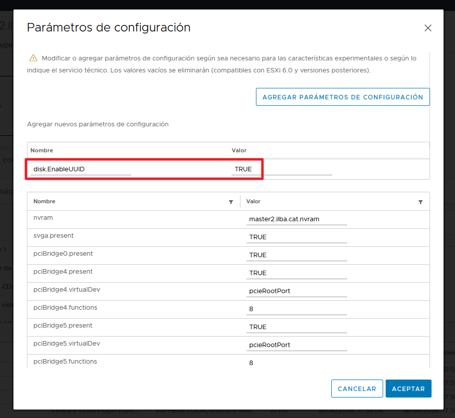
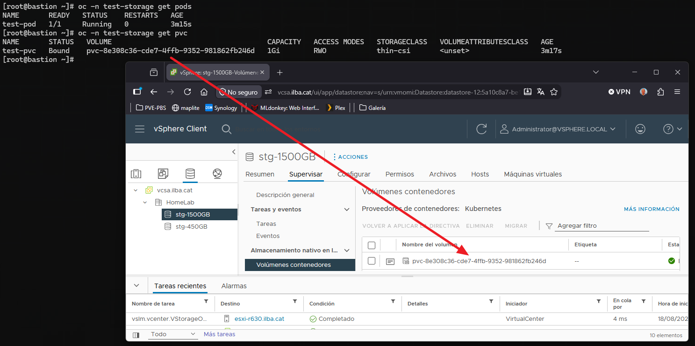

# Configuración de vSphere CSI Driver en OpenShift / OKD

* [Habilitar `disk.EnableUUID` en vSphere](#habilitar-diskenableuuid-en-vsphere)
* [Verificación del Estado del Clúster y StorageClass](#verificación-del-estado-del-clúster-y-storageclass)
* [Despliegue de Prueba (PVC y Pod)](#despliegue-de-prueba-pvc-y-pod)
* [Procedimientos de Troubleshooting](#procedimientos-de-troubleshooting)
  * [VSphereCSIDriverOperatorCRDegraded](#vspherecsidriveroperatorcrdegraded)
  * [unable to find VM master2.ilba.cat by UUID 37021342-7b2b-a5d8-9bf8-c94042a78d4f](#unable-to-find-vm-master2ilbacat-by-uuid-37021342-7b2b-a5d8-9bf8-c94042a78d4f)

## Habilitar `disk.EnableUUID` en vSphere

Para que el driver CSI de vSphere funcione, las Máquinas Virtuales de los nodos (Control Plane y Workers) deben tener habilitada la propiedad disk.EnableUUID. 
Sin esto, Linux no expone los UUIDs /dev/disk/by-id/ que necesita Kubernetes para identificar el volumen.

Como solucionarlo:
* Apaga los equipos
* En vCenter, haz clic derecho sobre la VM del Worker -> Edit Settings
* Ve a VM Options -> Advanced -> Configuration Parameters -> Edit Configuration.
* Revisa si existe la clave disk.EnableUUID:
  * Si no existe, añádela con el valor TRUE.
  * Si está en FALSE, cámbiala a TRUE.
* Enciende la VM de nuevo.



## Verificación del Estado del Clúster y StorageClass

Verificamos que el operador de almacenamiento responda correctamente y que la StorageClass por defecto (`thin-csi`) esté disponible:

```
[root@bastion ~]# oc get clusteroperator storage
NAME      VERSION             AVAILABLE   PROGRESSING   DEGRADED   SINCE   MESSAGE
storage   4.21.0-okd-scos.9   True        False         False      53s

[root@bastion ~]# oc get sc
NAME                 PROVISIONER              RECLAIMPOLICY   VOLUMEBINDINGMODE      ALLOWVOLUMEEXPANSION   AGE
thin-csi (default)   csi.vsphere.vmware.com   Delete          WaitForFirstConsumer   true                   3m32s
```

## Despliegue de Prueba (PVC y Pod)

Todos los datos de los PVCs, se guardaran en la carpeta "fcd" (First Class Disk) del storage: "stg-1500GB"

Para verificar que todo funciona correctamente, crearemos un proyecto dedicado y desplegaremos un Pod con su correspondiente PersistentVolumeClaim (PVC):

```
[root@bastion ~]# oc new-project test-storage \
--display-name="Proyecto prueba almacenamiento" \
--description="Este proyecto es para pruebas almacenamiento."
```

```
[root@bastion ~]# vim manifest/test-storage.yaml
apiVersion: v1
kind: PersistentVolumeClaim
metadata:
  name: test-pvc
  namespace: test-storage
spec:
  accessModes:
    - ReadWriteOnce
  resources:
    requests:
      storage: 1Gi
  storageClassName: thin-csi
---
apiVersion: v1
kind: Pod
metadata:
  name: test-pod
  namespace: test-storage
spec:
  containers:
  - name: app
    image: nginxinc/nginx-unprivileged:alpine
    volumeMounts:
    - mountPath: "/data"
      name: my-volume
  volumes:
  - name: my-volume
    persistentVolumeClaim:
      claimName: test-pvc
```

Aplicamos la configuración y comprobamos el estado de los recursos:

```
[root@bastion ~]# oc apply -f manifest/test-storage.yaml
```

```
[root@bastion ~]# oc -n test-storage get pods
NAME       READY   STATUS    RESTARTS   AGE
test-pod   1/1     Running   0          30s

[root@bastion ~]# oc -n test-storage get pvc
NAME       STATUS   VOLUME                                     CAPACITY   ACCESS MODES   STORAGECLASS   VOLUMEATTRIBUTESCLASS   AGE
test-pvc   Bound    pvc-8e308c36-cde7-4ffb-9352-981862fb246d   1Gi        RWO            thin-csi       <unset>                 33s
```


## Procedimientos de Troubleshooting

### VSphereCSIDriverOperatorCRDegraded

**Problema:**

El operador de almacenamiento muestra un estado DEGRADED=True indicando que los nodos no tienen el formato de providerID esperado por vSphere (vsphere://<UUID>):

```
[root@bastion ~]# oc get clusteroperator storage
NAME      VERSION             AVAILABLE   PROGRESSING   DEGRADED   SINCE   MESSAGE
storage   4.21.0-okd-scos.9   True        False         True       22h     VSphereCSIDriverOperatorCRDegraded: VMwareVSphereOperatorCheckDegraded: node master1.ilba.cat is not a vSphere node: providerID "" does not have the expected vSphere prefix "vsphere://"
```

**Solución: 1**

En instalaciones manuales (UPI), Kubelet puede no asignar automáticamente el providerID de vSphere si la VM no tenía inicialmente habilitado el parámetro disk.EnableUUID="TRUE". Vamos que no está marcado en el VMWare el parámetro disk.EnableUUID con valor "TRUE" al desplegar los equipos.


Ejecutaremos el siguiente script para extraer el systemUUID del nodo e inyectar o actualizar el campo spec.providerID en la API de OKD:

```
[root@bastion ~]# vim fix-diskEnableUUID.sh
#!/bin/bash

for node in $(oc get nodes -o jsonpath='{.items[*].metadata.name}'); do
    echo "=== Procesando $node ==="
    UUID=$(oc get node $node -o jsonpath='{.status.nodeInfo.systemUUID}')

    if [ -n "$UUID" ]; then
        oc patch node $node -p "{\"spec\":{\"providerID\":\"vsphere://${UUID}\"}}"
        echo "OK: providerID asignado a $node ($UUID)"
    else
        echo "ERROR: No se pudo obtener el systemUUID de $node"
    fi
done
```

```
[root@bastion ~]# chmod 755 fix-diskEnableUUID.sh
[root@bastion ~]# ./fix-diskEnableUUID.sh
[root@bastion ~]# oc rollout restart deployment/cluster-storage-operator -n openshift-cluster-storage-operator

[root@bastion ~]# oc get clusteroperator storage
NAME      VERSION             AVAILABLE   PROGRESSING   DEGRADED   SINCE   MESSAGE
storage   4.21.0-okd-scos.9   True        False         False      53s
```

**Solución: 2**

```
[root@bastion ~]# oc get nodes -o custom-columns=NAME:.metadata.name,PROVIDERID:.spec.providerID,UUID:.status.nodeInfo.systemUUID
NAME               PROVIDERID                                       UUID
master1.ilba.cat   vsphere://a5381342-6a0a-b4b9-b647-3007991cf1d6   a5381342-6a0a-b4b9-b647-3007991cf1d6
master2.ilba.cat   vsphere://37021342-7b2b-a5d8-9bf8-c94042a78d4f   37021342-7b2b-a5d8-9bf8-c94042a78d4f
master3.ilba.cat   vsphere://6d251342-e978-4577-9bfd-11b3a8e5a330   6d251342-e978-4577-9bfd-11b3a8e5a330
worker1.ilba.cat   vsphere://4213c824-3b6d-2b78-ea9f-a884965c0c98   24c81342-6d3b-782b-ea9f-a884965c0c98
worker2.ilba.cat   vsphere://42130c35-d08e-59f3-7e1d-e2d31174c131   350c1342-8ed0-f359-7e1d-e2d31174c131
worker3.ilba.cat   vsphere://4213fe82-ab32-aadc-4ab8-bef7f1065164   82fe1342-32ab-dcaa-4ab8-bef7f1065164
worker4.ilba.cat   vsphere://42130906-749a-8468-ccc0-c80de18a26f8   06091342-9a74-6884-ccc0-c80de18a26f8
```

```
$ ssh 172.26.0.6

[root@esxi-r630:~] vim-cmd vmsvc/getallvms | grep -i master1
28     master1.ilba.cat                            [stg-1500GB] master1.ilba.cat/master1.ilba.cat.vmx                                                     rhel9_64Guest         vmx-19

[root@esxi-r630:~] grep -i "uuid" /vmfs/volumes/stg-1500GB/master1.ilba.cat/*.vmx
uuid.bios = "42 13 38 a5 0a 6a b9 b4-b6 47 30 07 99 1c f1 d6"
vc.uuid = "50 13 0e 9f 49 4e 6a 6b-9d f6 bf bc e4 ac 51 7c"
uuid.location = "56 4d a9 13 6f 1a 29 7e-e2 2e 14 94 d8 8e c7 32"
disk.EnableUUID = "TRUE"
```

El error es que el UUID en VMware ESXi (uuid.bios) es: "42 13 38 a5 0a 6a b9 b4-b6 47 30 07 99 1c f1 d6" y el que tiene el nodo es: sphere://a5381342-6a0a-b4b9-b647-3007991cf1d6

En instalaciones manuales (UPI): Las máquinas virtuales se crearon manualmente en ESXi/vCenter y el sistema operativo arrancó leyendo el archivo .ign. El archivo de ignición configura usuarios, certificados, red y servicios del sistema operativo, pero no contiene ni define el providerID de Kubernetes, ya que la máquina aún no existe en el registro del clúster cuando el archivo .ign se compila.

*Re-registrar los Nodos Master con el ProviderID Correcto*

> Haz este procedimiento nodo por nodo de forma estrictamente secuencial. No elimines un máster hasta que el anterior esté completamente reincorporado y en estado Ready para evitar la pérdida de quórum en etcd.

```
[root@bastion ~]# oc adm cordon master1.ilba.cat
[root@bastion ~]# oc delete node master1.ilba.cat

[root@bastion ~]# ssh core@master1.ilba.cat "sudo systemctl restart kubelet"

[root@bastion ~]# oc get csr | grep -i pending
[root@bastion ~]# oc get csr -o go-template='{{range .items}}{{if not .status}}{{.metadata.name}}{{"\n"}}{{end}}{{end}}' | xargs -r oc adm certificate approve

[root@bastion ~]# oc patch node master1.ilba.cat -p '{"spec":{"providerID":"vsphere://421338a5-0a6a-b9b4-b647-3007991cf1d6"}}'
[root@bastion ~]# oc adm uncordon master1.ilba.cat

[root@bastion ~]# oc get nodes -o custom-columns=NAME:.metadata.name,PROVIDERID:.spec.providerID
NAME               PROVIDERID
master1.ilba.cat   vsphere://421338a5-0a6a-b9b4-b647-3007991cf1d6
master2.ilba.cat   vsphere://37021342-7b2b-a5d8-9bf8-c94042a78d4f
master3.ilba.cat   vsphere://6d251342-e978-4577-9bfd-11b3a8e5a330
worker1.ilba.cat   vsphere://4213c824-3b6d-2b78-ea9f-a884965c0c98
worker2.ilba.cat   vsphere://42130c35-d08e-59f3-7e1d-e2d31174c131
worker3.ilba.cat   vsphere://4213fe82-ab32-aadc-4ab8-bef7f1065164
worker4.ilba.cat   vsphere://42130906-749a-8468-ccc0-c80de18a26f8

[root@bastion ~]# oc rollout restart deployment/vmware-vsphere-csi-driver-operator -n openshift-cluster-csi-drivers

[root@bastion ~]# oc get co storage
NAME      VERSION             AVAILABLE   PROGRESSING   DEGRADED   SINCE   MESSAGE
storage   4.21.0-okd-scos.9   True        False         False      10m
```

### unable to find VM master2.ilba.cat by UUID 37021342-7b2b-a5d8-9bf8-c94042a78d4f

**Problema:**

```
[root@bastion ~]# oc get clusteroperator storage
NAME      VERSION             AVAILABLE   PROGRESSING   DEGRADED   SINCE   MESSAGE
storage   4.21.0-okd-scos.9   True        False         True       13m     VSphereCSIDriverOperatorCRDegraded: VMwareVSphereOperatorCheckDegraded: unable to find VM master2.ilba.cat by UUID 37021342-7b2b-a5d8-9bf8-c94042a78d4f
```

**Solución:**

```
[root@bastion ~]# oc adm cordon master3.ilba.cat
[root@bastion ~]# oc delete node master3.ilba.cat
[root@bastion ~]# ssh core@master3.ilba.cat "sudo systemctl restart kubelet"
[root@bastion ~]# oc get csr -o name | xargs oc adm certificate approve

[root@bastion ~]# oc get node master3.ilba.cat -o yaml | grep providerID
  providerID: vsphere://4213256d-78e9-7745-9bfd-11b3a8e5a330

[root@bastion ~]# oc adm uncordon master3.ilba.cat

[root@bastion ~]# oc rollout restart deployment/vsphere-problem-detector -n openshift-cluster-storage-operator 2>/dev/null || true
[root@bastion ~]# oc rollout restart deployment/cluster-storage-operator -n openshift-cluster-storage-operator

[root@bastion ~]# oc get nodes
NAME               STATUS   ROLES                         AGE    VERSION
master1.ilba.cat   Ready    control-plane,master,worker   125m   v1.34.4
master2.ilba.cat   Ready    control-plane,master,worker   125m   v1.34.4
master3.ilba.cat   Ready    control-plane,master,worker   63s    v1.34.4
worker1.ilba.cat   Ready    worker                        71m    v1.34.4
worker2.ilba.cat   Ready    worker                        68m    v1.34.4
worker3.ilba.cat   Ready    worker                        62m    v1.34.4
worker4.ilba.cat   Ready    worker                        59m    v1.34.4

[root@bastion ~]# oc get clusteroperator storage
NAME      VERSION             AVAILABLE   PROGRESSING   DEGRADED   SINCE   MESSAGE
storage   4.21.0-okd-scos.9   True        False         False      19h
```