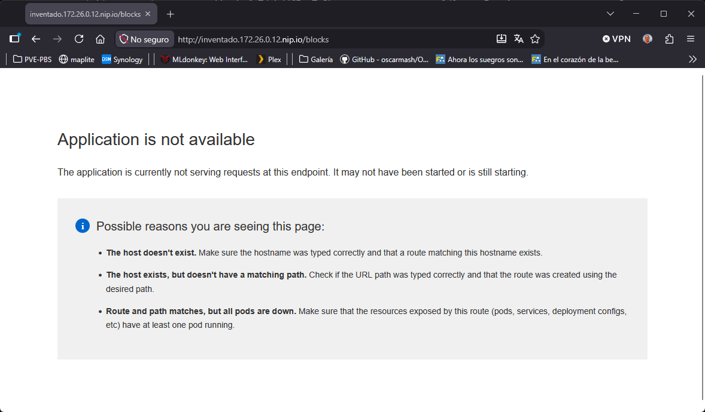
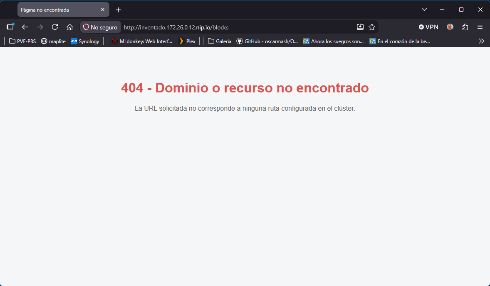

# Índice

* [Personalización de errores del Ingress](#personalización-de-errores-del-ingress)
  * [Error 503](#error-503)
  * [Error 404](#error-404)

# Personalización de errores del Ingress

El Ingress Controller (HAProxy) de OKD permite personalizar los siguientes códigos de error HTTP a través de archivos de plantilla (error-page-XXX.http) montados en el ConfigMap:

* Error 400: Con este error cubrimos las peticiones mal formadas, cabeceras HTTP corruptas o sintaxis inválida enviada por el cliente.
* Error 403: Con este error cubrimos los accesos bloqueados por políticas de control de acceso del router, filtrado de IPs por lista blanca o denegación de rutas.
* [Error 404](#error-404): Con este error cubrimos cuando el host o el path no existen
* Error 408: Con este error cubrimos cuando el cliente abre una conexión TCP hacia el router pero tarda demasiado tiempo en enviar los datos de la petición HTTP.
* Error 500: Con este error cubrimos fallos internos críticos de procesamiento o errores de memoria dentro del propio proceso HAProxy del router.
* Error 502: Con este error cubrimos cuando el router intenta conectarse al pod de la aplicación y este cierra la conexión abruptamente o devuelve una respuesta TCP/HTTP inválida.
* [Error 503](#error-503): Con este error cubrimos los casos en los que la ruta existe pero los pods están caídos o el servicio no responde.
* Error 504: Con este error cubrimos cuando el pod destino tarda más tiempo en responder del límite configurado en el timeout de la ruta (haproxy.router.openshift.io/timeout).

Ingress por defecto:



Ingress modificado:



## Error 503

Con este error cubrimos los casos en los que la ruta existe pero los pods están caídos o el servicio no responde.

```
[root@bastion ~]# vim manifest/error-page-503.http
HTTP/1.0 503 Service Unavailable
Pragma: no-cache
Cache-Control: no-cache
Content-Type: text/html

<!DOCTYPE html>
<html>
<head>
  <meta charset="utf-8">
  <title>Página no encontrada</title>
  <style>
    body { font-family: sans-serif; text-align: center; padding: 50px; background: #f4f6f8; }
    h1 { color: #333; }
    p { color: #666; }
  </style>
</head>
<body>
  <h1>Servicio no disponible</h1>
  <p>El dominio o la ruta solicitada no existe o no tiene servicios activos.</p>
</body>
</html>
```

```
[root@bastion ~]# oc create configmap custom-router-error-pages \
  --from-file=error-page-503.http=manifest/error-page-503.http \
  -n openshift-config
```

```
[root@bastion ~]# oc patch ingresscontroller default -n openshift-ingress-operator --type=merge -p '{
  "spec": {
    "httpErrorCodePages": {
      "name": "custom-router-error-pages"
    }
  }
}'
```

```
[root@bastion ~]# oc rollout status deployment/router-default -n openshift-ingress
```

## Error 404

Con este error cubrimos cuando el host o el path no existen

```
[root@bastion ~]# vim manifest/error-page-404.http
HTTP/1.0 404 Not Found
Pragma: no-cache
Cache-Control: no-cache
Content-Type: text/html

<!DOCTYPE html>
<html>
<head>
  <meta charset="utf-8">
  <title>Página no encontrada</title>
  <style>
    body { font-family: sans-serif; text-align: center; padding: 50px; background: #f4f6f8; }
    h1 { color: #d9534f; }
    p { color: #666; }
  </style>
</head>
<body>
  <h1>404 - Dominio o recurso no encontrado</h1>
  <p>La URL solicitada no corresponde a ninguna ruta configurada en el clúster.</p>
</body>
</html>
```

```
[root@bastion ~]# oc create configmap custom-router-error-pages \
  --from-file=error-page-503.http=manifest/error-page-503.http \
  --from-file=error-page-404.http=manifest/error-page-404.http \
  -n openshift-config \
  --dry-run=client -o yaml | oc apply -f -
```

Como ya hemos hecho el "patch ingresscontroller" en el anterior error, no es necesario hacerlo ahora.

```
[root@bastion ~]# oc rollout restart deployment/router-default -n openshift-ingress
```