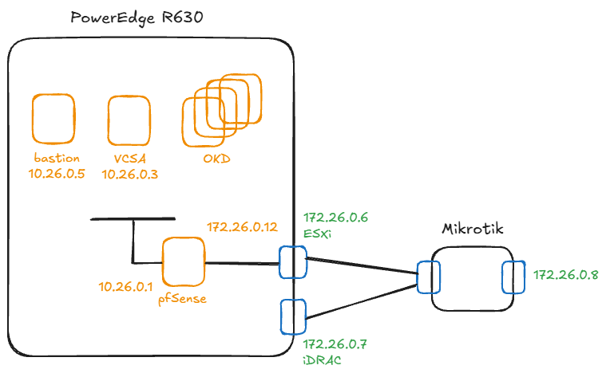

## Índice

* [Guía de Instalación OKD Bare-metal / UPI](#guía-de-instalación-okd-bare-metal--upi)
  * [Concepto UPI](#concepto-upi)
  * [Arquitectura del Clúster](#arquitectura-del-Clúster)
  * [Especificaciones de Nodos OKD / OpenShift](#especificaciones-de-nodos-okd--openshift)
  * [Estimación de Tráfico de Red (Instalación Bare-metal / UPI)](#estimación-de-tráfico-de-red-instalación-bare-metal--upi)
  * [Habilitar disk.EnableUUID](#habilitar-diskenableuuid)
* [Preparación del Servidor Bastión](#preparación-del-servidor-bastión)
  * [Instalación de Servicios Base](#instalación-de-servicios-base)
* [Despliegue de OKD](#despliegue-de-okd)
  * [Instalación del Nodo Bootstrap](#instalación-del-nodo-bootstrap)
      * [Obtención de la ISO de SCOS / CoreOS](#obtención-de-la-iso-de-scos--coreos)
    * [Instalación en el Nodo Bootstrap](#instalación-en-el-nodo-bootstrap)
    * [Monitorización del Nodo Bootstrap](#monitorización-del-nodo-bootstrap)
  * [Instalación de Nodos Masters (Control Plane)](#instalación-de-nodos-masters-control-plane)
    * [Aprobación de Certificados y Taints Iniciales](#aprobación-de-certificados-y-taints-iniciales)
  * [Instalación de Nodos Workers (Compute)](#instalación-de-nodos-workers-compute)
    * [Monitorización y aprobación de CSRs](#monitorización-y-aprobación-de-csrs)
    * [Aislamiento del Control Plane](#desactivación-del-schedulable-en-nodos-master-aislamiento-del-control-plane)


## Guía de Instalación OKD Bare-metal / UPI

### Concepto UPI

UPI (User-Provisioned Infrastructure) -> El administrador crea y gestiona manualmente toda la infraestructura: redes, balanceador de carga como HAProxy, registros DNS en Bind/Unbound, almacenamiento y las propias máquinas virtuales en vCenter o servidores físicos

### Arquitectura del Clúster



### Especificaciones de Nodos OKD / OpenShift

| Rol del Nodo | Cantidad | vCPU (por nodo) | RAM (por nodo) | Disco (Thin) | Total vCPU | Total RAM | Total Disco |
| :--- | :---: | :---: | :---: | :---: | :---: | :---: | :---: |
| **Bootstrap** *(Temporal)* | 1 | 4 vCPU | 16 GB | 120 GB | 4 vCPU | 16 GB | 120 GB |
| **Control Plane** *(Master)* | 3 | 4 vCPU | 16 GB | 120 GB | 12 vCPU | 48 GB | 360 GB |
| **Compute** *(Worker)* | 2 | 4 vCPU | 16 GB | 120 GB | 8 vCPU | 32 GB | 240 GB |
| **TOTAL (Sostenido)** | **5** | — | — | — | **20 vCPU** | **80 GB** | **600 GB** |

> **Nota:** El nodo *Bootstrap* se destruye tras la instalación, dejando el consumo del clúster en 5 nodos activos (20 vCPU, 80 GB RAM, 600 GB Disco).

### Estimación de Tráfico de Red (Instalación Bare-metal / UPI)

| Rol del Nodo | Cantidad | Descarga aprox. (por nodo) | Tráfico Acumulado |
| :--- | :---: | :---: | :---: |
| **Control Plane** *(Master)* | 3 | 5.0 GB - 6.0 GB | 15.0 GB - 18.0 GB |
| **Compute** *(Worker)* | 2 | 4.5 GB - 5.5 GB | 9.0 GB - 11.0 GB |
| **TOTAL ESTIMADO** | **5** | — | **~25 GB - 30 GB** |

### Habilitar disk.EnableUUID

Antes de desplegar los equipos si vamos a usar el storage de VMWare, habilitar en los equipos el flag: "Habilitar disk.EnableUUID"

## Preparación del Servidor Bastión

### Instalación de Servicios Base

```
dnf install -y haproxy httpd dhcp-server wget open-vm-tools bind-utils
```

Todos los ficheros losm podemos encontrar en la carpeta files:

```
vim /etc/httpd/conf/httpd.conf
vim /etc/haproxy/haproxy.cfg
vim /etc/dhcp/dhcpd.conf
vim /etc/named.conf
vim /var/named/ilba.cat.db
vim /var/named/ilba.cat.reverse
```

```
chown named:named /var/named/ilba.cat.db
chown named:named /var/named/ilba.cat.reverse
named-checkconf /etc/named.conf
```

```
systemctl disable firewalld
systemctl enable vmtoolsd --now
systemctl enable httpd --now
systemctl enable haproxy --now
systemctl enable dhcpd --now
systemctl enable named --now
```

## Despliegue de OKD

```
mkdir ~/okd-install
cd ~/okd-install/
```

Cuidado que se ha de mapear la versión de OKD con K8s (https://github.com/okd-project/okd/releases):
* OpenShift/OKD 4.14 -> Kubernetes 1.27
* OpenShift/OKD 4.15 -> Kubernetes 1.28
* OpenShift/OKD 4.16 -> Kubernetes 1.29
* etc....

```
wget https://github.com/okd-project/okd/releases/download/4.21.0-okd-scos.9/openshift-client-linux-4.21.0-okd-scos.9.tar.gz
wget https://github.com/okd-project/okd/releases/download/4.21.0-okd-scos.9/openshift-install-linux-4.21.0-okd-scos.9.tar.gz

tar -xvf openshift-client-linux-*.tar.gz
tar -xvf openshift-install-linux-*.tar.gz

mv oc kubectl openshift-install /usr/local/bin/
rm README.md
```

Generar clave SSH para acceso administrativo a los nodos:

```
ssh-keygen -t rsa -b 4096 -C "root@bastion.ilba.cat"
```

Creación de Configuración e Ignitions:

```
mkdir ~/cluster-okd
cd ~/cluster-okd
```

```
vi install-config.yaml

cp install-config.yaml install-config.yaml.bak

openshift-install create manifests --dir=.
openshift-install create ignition-configs --dir=.

cp *.ign /var/www/html/
chmod 644 /var/www/html/*.ign
```

Verificación de Resolución DNS

```
dig +short api.okd.ilba.cat @127.0.0.1      -> 10.26.0.5
dig +short api-int.okd.ilba.cat @127.0.0.1  -> 10.26.0.5
dig +short master1.ilba.cat @127.0.0.1      -> 10.26.0.11
dig +short -x 10.26.0.10 @127.0.0.1         -> bootstrap.ilba.cat.
dig +short -x 10.26.0.21 @127.0.0.1         -> worker1.ilba.cat.
```

### Instalación del Nodo Bootstrap

#### Obtención de la ISO de SCOS / CoreOS

```
[root@bastion ~]# openshift-install coreos print-stream-json | jq -r '.architectures.x86_64.artifacts.metal.formats.iso.disk.location'
https://rhcos.mirror.openshift.com/art/storage/prod/streams/c10s/builds/10.0.20251103-0/x86_64/scos-10.0.20251103-0-live-iso.x86_64.iso
```

#### Instalación en el Nodo Bootstrap

Arrancamos bootstrap (recuerda que es un equipo temporal) y lanzamos el siguiente comando:

```
sudo coreos-installer install /dev/sda \
--ignition-url=http://10.26.0.5:8080/bootstrap.ign \
--insecure-ignition

sudo reboot
```

#### Monitorización del Nodo Bootstrap


Desactivar la verificación de claves del host y configurar el cliente SSH para que ignore el known_hosts y no pida confirmación:

```
cat <<EOF >> /etc/ssh/ssh_config.d/99-disable-strict-checking.conf
Host *
    StrictHostKeyChecking no
    UserKnownHostsFile /dev/null
    LogLevel ERROR
EOF
```

Una vez reiniciado, se puede seguir la descarga de paquetes e inicio de servicios:

```
[root@bastion ~]# ssh core@bootstrap
core@bootstrap:~$ journalctl -u rpm-ostreed -f  <- Aquí es donde venmos que se va descargando las cosas
```

Una vez acabado, se reiniciará solo y una vez arrancado: esperar, sino el master irá dando errores

```
core@bootstrap:~$ sudo journalctl -b -u bootkube.service -f
```

Pasados unos minutos podremos lanzar el siguiente comando.

El mensaje: "until 8:43AM CEST", es indicativo y quiere decir: "Voy a quedarme escuchando a la API durante un máximo de 1 hora, si en 60 minutos los 3 másters no han terminado de descargar sus pods, daré el comando por fallado (timeout) y te devolveré el control del prompt"
Durante esta ventana, el nodo bootstrap levantará una API pública/temporal esperando la integración de los másters.

```
[root@bastion ~]# openshift-install wait-for bootstrap-complete --dir=/root/cluster-okd/ --log-level=info
INFO Waiting up to 20m0s (until 8:03AM CEST) for the Kubernetes API at https://api.okd.ilba.cat:6443...
INFO API v1.28.2-3598+6e2789bbd58938-dirty up
INFO Waiting up to 1h0m0s (until 8:43AM CEST) for bootstrapping to complete...
```

La linea anterior que indica: "for bootstrapping to complete...", significa: "el nodo bootstrap ha levantado correctamente la API temporal y está listo para recibir a los másters"

### Instalación de Nodos Masters (Control Plane)

```
[root@bastion ~]# curl -k https://10.26.0.10:22623/config/master
```

Arrancamos los 3 servidores de master y lanzamos el siguiente comando en cada uno:

```
sudo coreos-installer install /dev/sda \
--ignition-url=http://10.26.0.5:8080/master.ign \
--insecure-ignition

sudo reboot
```

Una vez arrancados los equipos, empezaran a aparecer. Los equipos Masters se reiniciaran solos

#### Aprobación de Certificados y Taints Iniciales

```
[root@bastion ~]# export KUBECONFIG=/root/cluster-okd/auth/kubeconfig

[root@bastion ~]# oc get nodes
NAME               STATUS     ROLES                  AGE     VERSION
master1.ilba.cat   NotReady   control-plane,master   2m35s   v1.34.4
master2.ilba.cat   NotReady   control-plane,master   2m35s   v1.34.4
master3.ilba.cat   NotReady   control-plane,master   2m17s   v1.34.4
```

```
[root@bastion ~]# oc get csr
[root@bastion ~]# oc get csr -o name | xargs oc adm certificate approve
```

Quitamos la marca de "uninitialized" de los masters para que pueda desplegar los pods de sistema (red, DNS, etc...)

```
[root@bastion ~]# oc adm taint nodes master1.ilba.cat node.cloudprovider.kubernetes.io/uninitialized-
[root@bastion ~]# oc adm taint nodes master2.ilba.cat node.cloudprovider.kubernetes.io/uninitialized-
[root@bastion ~]# oc adm taint nodes master3.ilba.cat node.cloudprovider.kubernetes.io/uninitialized-
```

El siguiente contenedor tarda unos 5m desde aprovar los certificados en aparecer

```
[root@bastion ~]# oc get pods -n openshift-network-operator
NAME                                READY   STATUS    RESTARTS   AGE
iptables-alerter-5dnmc              1/1     Running   0          30s
iptables-alerter-f2fd4              1/1     Running   0          30s
iptables-alerter-q4znf              1/1     Running   0          30s
network-operator-76d496774c-ms7j8   1/1     Running   0          89s
```

El siguiente contenedor tarda unos minutos desde que se aprueben los certificados en aparecer

```
[root@bastion ~]# oc get pods -n openshift-ovn-kubernetes
NAME                                     READY   STATUS    RESTARTS   AGE
ovnkube-control-plane-68798d4445-bck2t   2/2     Running   0          27m
ovnkube-control-plane-68798d4445-lbhft   2/2     Running   0          27m
ovnkube-node-c6nr8                       8/8     Running   0          94s
ovnkube-node-drjjh                       8/8     Running   0          96s
ovnkube-node-tdtb7                       8/8     Running   0          84s
```

Una vez creado estos contenedores, empezaremos a ver "Ready" en el cluster.

```
[root@bastion ~]# oc get nodes
NAME               STATUS   ROLES                  AGE     VERSION
master1.ilba.cat   Ready    control-plane,master   3m20s   v1.34.4
master2.ilba.cat   Ready    control-plane,master   3m20s   v1.34.4
master3.ilba.cat   Ready    control-plane,master   3m2s    v1.34.4
```

Seguimos esperando hasta que el siguiente comando esté todo en "True"

```
[root@bastion ~]# oc get co | grep -E "NAME|etcd|kube-apiserver|kube-controller|kube-scheduler|machine-config|network|dns"
NAME                                       VERSION             AVAILABLE   PROGRESSING   DEGRADED   SINCE   MESSAGE
dns                                        4.21.0-okd-scos.9   True        False         False      31m
etcd                                       4.21.0-okd-scos.9   True        False         False      23m
kube-apiserver                             4.21.0-okd-scos.9   True        False         False      19m
kube-controller-manager                    4.21.0-okd-scos.9   True        False         False      20m
kube-scheduler                             4.21.0-okd-scos.9   True        False         False      23m
machine-config                             4.21.0-okd-scos.9   True        False         False      31m
network                                    4.21.0-okd-scos.9   True        False         False      34m

[root@bastion ~]# oc get nodes
NAME               STATUS   ROLES                         AGE   VERSION
master1.ilba.cat   Ready    control-plane,master,worker   24m   v1.34.4
master2.ilba.cat   Ready    control-plane,master,worker   24m   v1.34.4
master3.ilba.cat   Ready    control-plane,master,worker   23m   v1.34.4

[root@bastion ~]# openshift-install wait-for bootstrap-complete --dir=/root/cluster-okd/ --log-level=info
INFO Waiting up to 20m0s (until 11:47AM CEST) for the Kubernetes API at https://api.okd.ilba.cat:6443...
INFO API v1.28.2-3598+6e2789bbd58938-dirty up
INFO Waiting up to 1h0m0s (until 12:27PM CEST) for bootstrapping to complete...
INFO It is now safe to remove the bootstrap resources
INFO Time elapsed: 0s
```

Paramos el bootstrap y añadimos los workers

```
[root@bastion ~]# ssh core@bootstrap
[core@bootstrap ~]$ sudo poweroff
```

### Instalación de Nodos Workers (Compute)

```
sudo coreos-installer install /dev/sda \
--ignition-url=http://10.26.0.5:8080/worker.ign \
--insecure-ignition

sudo reboot
```

```
[root@bastion ~]# ssh core@worker1
core@worker1:~$ journalctl -u rpm-ostreed -f      <- Aquí es donde venmos que se va descargando las cosas
```

Una vez acabado rebotará los workers.

#### Monitorización y aprobación de CSRs

```
[root@bastion ~]# export KUBECONFIG=/root/cluster-okd/auth/kubeconfig
[root@bastion ~]# oc get csr
[root@bastion ~]# oc get csr -o name | xargs oc adm certificate approve

[root@bastion ~]# oc get nodes
NAME               STATUS     ROLES                         AGE   VERSION
master1.ilba.cat   Ready      control-plane,master,worker   38m   v1.34.4
master2.ilba.cat   Ready      control-plane,master,worker   38m   v1.34.4
master3.ilba.cat   Ready      control-plane,master,worker   38m   v1.34.4
worker1.ilba.cat   NotReady   worker                        14s   v1.34.4
worker2.ilba.cat   NotReady   worker                        8s    v1.34.4

[root@bastion ~]# oc get csr
[root@bastion ~]# oc get csr -o name | xargs oc adm certificate approve

[root@bastion ~]# oc get nodes
NAME               STATUS   ROLES                         AGE    VERSION
master1.ilba.cat   Ready    control-plane,master,worker   40m    v1.34.4
master2.ilba.cat   Ready    control-plane,master,worker   40m    v1.34.4
master3.ilba.cat   Ready    control-plane,master,worker   40m    v1.34.4
worker1.ilba.cat   Ready    worker                        114s   v1.34.4
worker2.ilba.cat   Ready    worker                        111s   v1.34.4
```

#### Desactivación del Schedulable en Nodos Master (Aislamiento del Control Plane)

Por defecto, los nodos máster aceptan cargas de trabajo (schedulable). Para garantizar la estabilidad del plano de control, desactiva el despliegue de pods de usuario en los másters:

```
[root@bastion ~]# oc patch scheduler cluster --type='json' -p='[{"op": "replace", "path": "/spec/mastersSchedulable", "value": false}]'

[root@bastion ~]# oc get nodes
NAME               STATUS   ROLES                  AGE   VERSION
master1.ilba.cat   Ready    control-plane,master   66m   v1.34.4
master2.ilba.cat   Ready    control-plane,master   66m   v1.34.4
master3.ilba.cat   Ready    control-plane,master   65m   v1.34.4
worker1.ilba.cat   Ready    worker                 27m   v1.34.4
worker2.ilba.cat   Ready    worker                 27m   v1.34.4
```