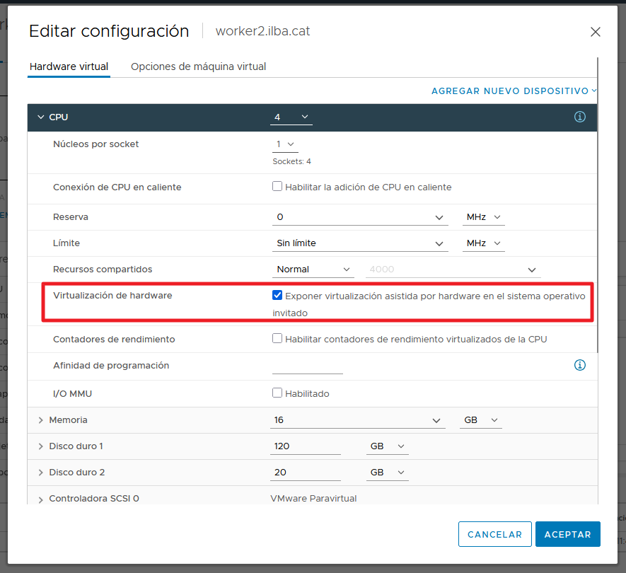

# Enable nested virtualization en VMWare

## Verificación de nested virtualization

Comprobamos si los workers ya tienen KVM activo:

```
[root@bastion ~]# oc debug node/worker1.ilba.cat -- chroot /host ls -l /dev/kvm
```

* Si devuelve *crw-rw---- 1 root kvm ... /dev/kvm*: Todo perfecto, tienes aceleración KVM por hardware.
* Si dice *No such file or directory*: Falta activar la casilla en VMware o el procesador no lo tiene habilitado en BIOS.

## Enable nested virtualization

> Este cambio sólo es necesario en los Workers, no en los "Control Plane"

Como activamos el nested (virtualización anidada) en ESXi:

* En el cliente web de vCenter/ESXi, apaga y edita las VMs
* En Edit Settings :arrow_right: despliega la sección CPU
 * Marca la casilla :arrow_right: Exponer virtualización asistida por hardware en el sistema operativo invitado
* Guarda y arranca el nodo



Al habilitar el nested virtualization, nos podemos encontrar con los workers en "NotReady":

```
[root@bastion ~]# oc get csr -o name | xargs oc adm certificate approve
```

# Instalación de KubeVirt

Buscaremos el paquete disponible en el catálogo:

```
[root@bastion ~]# oc get packagemanifest -n openshift-marketplace | grep -iE "kubevirt|hyperconverged"
community-kubevirt-hyperconverged           Community Operators   15d

[root@bastion ~]# oc get packagemanifest community-kubevirt-hyperconverged -n openshift-marketplace -o jsonpath='{.status.defaultChannel}{"\n"}'
stable
```

```
[root@bastion ~]# vim manifest/install-kubevirt-operator.yaml
apiVersion: v1
apiVersion: v1
kind: Namespace
metadata:
  name: kubevirt-hyperconverged
  labels:
    openshift.io/cluster-monitoring: "true"
---
apiVersion: operators.coreos.com/v1
kind: OperatorGroup
metadata:
  name: kubevirt-hyperconverged-group
  namespace: kubevirt-hyperconverged
spec: {}
---
apiVersion: operators.coreos.com/v1alpha1
kind: Subscription
metadata:
  name: community-kubevirt-hyperconverged
  namespace: kubevirt-hyperconverged
spec:
  channel: stable
  installPlanApproval: Manual
  name: community-kubevirt-hyperconverged
  source: community-operators
  sourceNamespace: openshift-marketplace
```

```
[root@bastion ~]# oc apply -f manifest/install-kubevirt-operator.yaml
```

```
[root@bastion ~]# oc get subscription -n kubevirt-hyperconverged
NAME                                PACKAGE                             SOURCE                CHANNEL
community-kubevirt-hyperconverged   community-kubevirt-hyperconverged   community-operators   stable

[root@bastion ~]# oc get installplan -n kubevirt-hyperconverged
NAME            CSV                                        APPROVAL   APPROVED
install-7n26k   kubevirt-hyperconverged-operator.v1.17.3   Manual     false

oc patch installplan $(oc get installplan -n kubevirt-hyperconverged -o jsonpath='{.items[0].metadata.name}') \
  -n kubevirt-hyperconverged \
  --type merge \
  -p '{"spec":{"approved":true}}'

[root@bastion ~]# oc get installplan -n kubevirt-hyperconverged
NAME            CSV                                        APPROVAL   APPROVED
install-7n26k   kubevirt-hyperconverged-operator.v1.17.3   Manual     true

[root@bastion ~]# oc get csv -n kubevirt-hyperconverged
NAME                                       DISPLAY                                    VERSION   REPLACES                                   PHASE
kubevirt-hyperconverged-operator.v1.17.3   KubeVirt HyperConverged Cluster Operator   1.17.3    kubevirt-hyperconverged-operator.v1.16.0   Succeeded

[root@bastion ~]# oc get pods -n kubevirt-hyperconverged
NAME                                                  READY   STATUS    RESTARTS   AGE
aaq-operator-76578f8567-7hbr8                         1/1     Running   0          81s
cdi-operator-84794c75b7-qzgrd                         1/1     Running   0          83s
cluster-network-addons-operator-6b95ffc586-zf75d      2/2     Running   0          85s
hco-operator-5c67955f76-wc2g5                         1/1     Running   0          89s
hco-webhook-6c4c4665f4-pgbj6                          1/1     Running   0          88s
hostpath-provisioner-operator-5ddd547f76-cf2bd        1/1     Running   0          82s
hyperconverged-cluster-cli-download-7f4b5d66b-kwgm6   1/1     Running   0          87s
kubevirt-migration-operator-55cd864d44-zcls8          1/1     Running   0          80s
ssp-operator-8665578b8b-q4k4j                         1/1     Running   0          83s
virt-operator-6b59d644fb-5n8xp                        1/1     Running   0          84s
virt-operator-6b59d644fb-sqc69                        1/1     Running   0          84s
```

# Desplegar el motor de KubeVirt (HyperConverged)

Al aplicar el siguiente manifiest, el operador despliega automáticamente KubeVirt:
* virt-handler: es el componente que interactúa de forma directa con el kernel de Linu, gestiona libvirt/QEMU en el nodo y arranca físicamente las máquinas virtuales.
* virt-api: expone los endpoints de la API específicos de KubeVirt (por ejemplo, para permitir que virtctl abra túneles VNC, consolas serie o gestione el apagado/reinicio).
* etc...

```
[root@bastion ~]# vim manifest/HyperConverged.yaml
apiVersion: hco.kubevirt.io/v1beta1
kind: HyperConverged
metadata:
  name: kubevirt-hyperconverged
  namespace: kubevirt-hyperconverged
spec:
  infra: {}
  workloads: {}

[root@bastion ~]# oc apply -f manifest/HyperConverged.yaml
[root@bastion ~]# oc get pods -n kubevirt-hyperconverged
```

# Instalar la CLI virtctl en el Bastión

```
[root@bastion ~]# VERSION=$(curl -s https://api.github.com/repos/kubevirt/kubevirt/releases/latest | grep tag_name | cut -d '"' -f 4)
[root@bastion ~]# curl -L -o /usr/local/bin/virtctl https://github.com/kubevirt/kubevirt/releases/download/${VERSION}/virtctl-${VERSION}-linux-amd64
[root@bastion ~]# chmod +x /usr/local/bin/virtctl
[root@bastion ~]# virtctl version --client
```

# Creación de una debian

```
[root@bastion ~]# oc new-project test-kubevirt
```


```
[root@bastion ~]# vim manifest/kubevirt-debian12.yaml
apiVersion: kubevirt.io/v1
kind: VirtualMachine
metadata:
  name: debian12-vm
  namespace: test-kubevirt
spec:
  running: true
  template:
    metadata:
      labels:
        kubevirt.io/vm: debian12-vm
    spec:
      domain:
        devices:
          disks:
            - name: datavolumedisk
              disk:
                bus: virtio
            - name: cloudinitdisk
              disk:
                bus: virtio
          interfaces:
            - name: default
              masquerade: {}
        resources:
          requests:
            memory: 2Gi
            cpu: "2"
      networks:
        - name: default
          pod: {}
      volumes:
        # El disco persistente del sistema operativo
        - name: datavolumedisk
          dataVolume:
            name: debian12-root-disk
        # Inyección de credenciales y usuario con Cloud-Init
        - name: cloudinitdisk
          cloudInitNoCloud:
            userData: |
              #cloud-config
              user: "oscar.mas"
              password: "Password1234"
              chpasswd: { expire: False }
              ssh_pwauth: True
              runcmd:
                - echo "Debian en KubeVirt operativo" > /etc/motd
  dataVolumeTemplates:
    - metadata:
        name: debian12-root-disk
      spec:
        storage:
          accessModes:
            - ReadWriteOnce
          storageClassName: thin-csi
          resources:
            requests:
              storage: 20Gi
        source:
          http:
            url: "https://cloud.debian.org/images/cloud/bookworm/latest/debian-12-generic-amd64.qcow2"
```

```
[root@bastion ~]# oc apply -f manifest/kubevirt-debian12.yaml
```

```
[root@bastion ~]# oc get -n test-kubevirt vm
NAME          AGE   STATUS    READY
debian12-vm   88s   Running   True

[root@bastion ~]# oc get -n test-kubevirt vmi
NAME          AGE   PHASE     IP            NODENAME           READY
debian12-vm   89s   Running   10.130.2.29   worker4.ilba.cat   True
```

```
[root@bastion ~]# virtctl -n test-kubevirt console debian12-vm
Successfully connected to debian12-vm console. Press Ctrl+] or Ctrl+5 to exit console.

debian12-vm login: oscar.mas
Password:
Linux debian12-vm 6.1.0-53-amd64 #1 SMP PREEMPT_DYNAMIC Debian 6.1.187-1 (2026-09-07) x86_64
Debian en KubeVirt operativo
oscar.mas@debian12-vm:~$
```

# Live Migration (Migración en caliente / en vivo)

Error que nos ha saldio:

```
[root@bastion ~]# virtctl -n test-kubevirt migrate debian12-vm
You are using a client virtctl version that is different from the KubeVirt version running in the cluster
Client Version: v1.9.0
Server Version: v1.7.4

Error migrating VirtualMachine Internal error occurred: admission webhook "migration-create-validator.kubevirt.io" denied the request: Cannot migrate VMI, Reason: DisksNotLiveMigratable, Message: cannot migrate VMI: PVC debian12-root-disk is not shared, live migration requires that all PVCs must be shared (using ReadWriteMany access mode)
```

En mi cluster de OKD, el StorageClass por defecto (thin-csi) utiliza el driver CSI de VMware vSphere para aprovisionar discos en bloque (VMDK), estos funcionan exclusivamente en modo ReadWriteOnce (RWO). Al no disponer de vSAN File Service ni de un sistema de archivos compartido compatible (como CephFS o NFS), los volúmenes no admiten ReadWriteMany (RWX). Así que no puedo hacer un Live Migration :rage: