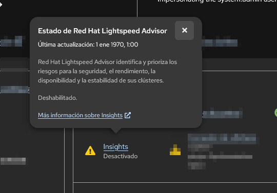

Insights: analiza continuamente la configuración, la salud y la seguridad de tus clústeres para detectar problemas antes de que causen una caída o una brecha de seguridad.

OKD es la versión Community: Al tratarse de OKD (la distribución comunitaria upstream de OpenShift), no dispone de soporte comercial ni integración por defecto con SaaS de pago de Red Hat, por lo que el operador no envía datos y la consola marca el estado como Deshabilitado.

