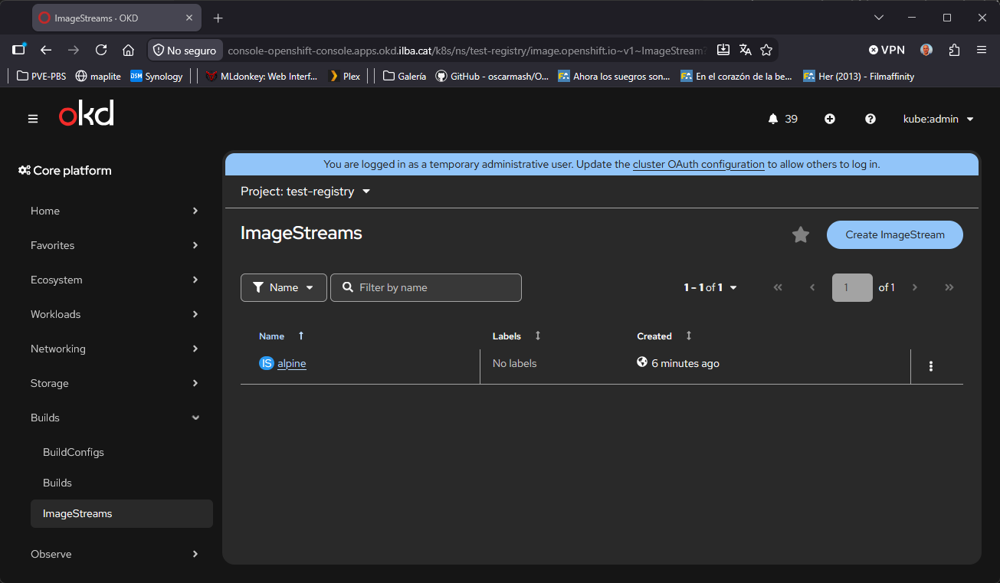

# Registry

- [Registry](#registry)
  - [Añadir storage persistente al Registry](#añadir-storage-persistente-al-registry)
  - [Verificación del registry](#verificación-del-registry)
  - [Login al Registry](#login-al-registry)

Datos del Registry de OpenShift/OKD
* Por Namespace (Aislamiento por defecto): Toda imagen subida a <registro>/<mi-namespace>/<imagen>:<tag> es privada para dicho proyecto. Otros namespaces no pueden consumirla a menos que se les otorgue el rol system:image-puller explícitamente en ese proyecto.
* Namespace Global (openshift): Las imágenes subidas a <registro>/openshift/<imagen>:<tag> son automáticamente públicas y de solo lectura para todos los usuarios y pods de cualquier namespace del clúster.

## Añadir storage persistente al Registry

El registry de OKD, al ser un despliegue sobre VMware/UPI arranca en estado Removed porque no tiene ningún disco asignado donde guardar las capas de las imágenes, lo que hemos de hacer es asignarle un CSI, para que se puedan guardar los datos:

```
[root@bastion ~]# vim manifest/pvc_registry.yaml
apiVersion: v1
kind: PersistentVolumeClaim
metadata:
  name: image-registry-storage
  namespace: openshift-image-registry
spec:
  accessModes:
    - ReadWriteOnce
  resources:
    requests:
      storage: 100Gi
  storageClassName: thin-csi

[root@bastion ~]# oc apply -f manifest/pvc_registry.yaml
```

```
[root@bastion ~]# oc get configs.imageregistry.operator.openshift.io/cluster -o jsonpath='{.spec.managementState}{"\n"}'
Removed

[root@bastion ~]# oc patch configs.imageregistry.operator.openshift.io/cluster --type merge -p '{"spec":{"managementState":"Managed","replicas":1,"rolloutStrategy":"Recreate","storage":{"pvc":{"claim":"image-registry-storage"}}}}'

[root@bastion ~]# oc get configs.imageregistry.operator.openshift.io/cluster -o jsonpath='{.spec.managementState}{"\n"}'
Managed

[root@bastion ~]# oc get pods -n openshift-image-registry

[root@bastion ~]# oc get pods -n openshift-image-registry
NAME                                               READY   STATUS    RESTARTS   AGE
cluster-image-registry-operator-69756d4cc6-jszcw   1/1     Running   12         7d21h
image-registry-76668455b7-snk8k                    1/1     Running   0          2m38s
node-ca-6bbzm                                      1/1     Running   12         7d20h
node-ca-7rj4p                                      1/1     Running   11         7d20h
node-ca-7vfwg                                      1/1     Running   12         7d20h
node-ca-8nc57                                      1/1     Running   10         7d2h
node-ca-9wbp2                                      1/1     Running   12         7d20h
node-ca-bxbz4                                      1/1     Running   13         7d20h
node-ca-k6f6n                                      1/1     Running   11         7d20h
```

## Verificación del registry

Verificaremos que el regstry esté funcionando correctamente. Pero antes hemos de darle acceso:

```
[root@bastion ~]# vim manifest/image-registry-config.yaml
apiVersion: imageregistry.operator.openshift.io/v1
kind: Config
metadata:
  name: cluster
spec:
  managementState: Managed
  replicas: 1
  rolloutStrategy: Recreate
  storage:
    pvc:
      claim: "image-registry-storage"
  routes:
    - name: custom-registry-route
      hostname: registry.172.26.0.12.nip.io
      tls:
        termination: reencrypt

[root@bastion ~]# oc apply -f manifest/image-registry-config.yaml

[root@bastion ~]# oc get routes -n openshift-image-registry
NAME                    HOST/PORT                     PATH   SERVICES         PORT    TERMINATION   WILDCARD
custom-registry-route   registry.172.26.0.12.nip.io          image-registry   <all>   reencrypt     None
```

## Login al Registry

```
[root@bastion ~]# cat /etc/hosts
10.26.0.5       registry.172.26.0.12.nip.io

[root@bastion ~]# TOKEN=$(oc create token builder -n test-registry --duration=24h)

[root@bastion ~]# podman login -u kubeadmin -p $TOKEN --tls-verify=false registry.172.26.0.12.nip.io
Login Succeeded!

[root@bastion ~]# podman pull docker.io/library/alpine:latest

[root@bastion ~]# oc create ns test-registry
[root@bastion ~]# oc project test-registry
[root@bastion ~]# podman login -u unused -p $TOKEN --tls-verify=false registry.172.26.0.12.nip.io
[root@bastion ~]# podman tag docker.io/library/alpine:latest registry.172.26.0.12.nip.io/test-registry/alpine:latest
[root@bastion ~]# podman push --tls-verify=false registry.172.26.0.12.nip.io/test-registry/alpine:latest

[root@bastion ~]# oc get is -n test-registry
NAME     IMAGE REPOSITORY                                   TAGS     UPDATED
alpine   registry.172.26.0.12.nip.io/test-registry/alpine   latest   50 seconds ago
```

