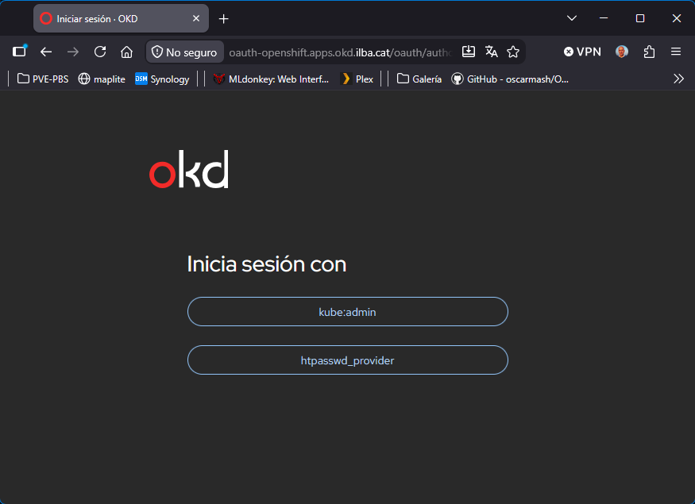

## Índice

- [Crear un usuario administrador](#crear-un-usuario-administrador)
- [Crear un usuario](#crear-un-usuario)
- [Volver al contexto de admin](#volver-al-contexto-de-admin)
# Crear un usuario administrador

Crear un usuario administrador como el *kubeadmin*

```
[root@bastion ~]# cat .bashrc | grep KUBECONFIG
export KUBECONFIG=/root/cluster-okd/auth/kubeconfig

[root@bastion ~]# env | grep KUBECONFIG
KUBECONFIG=/root/cluster-okd/auth/kubeconfig

[root@bastion ~]# oc whoami
system:admin
```

Necesitamos la herramienta *httpd-tools*:

```
[root@bastion ~]# dnf install -y httpd-tools
```

Si en el futuro quieres añadir más usuarios al mismo archivo, usa la opción sin -c: htpasswd -B -b /root/users.htpasswd otro_usuario password:

```
[root@bastion ~]# htpasswd -c -B -b /root/manifest/users.htpasswd oscar.mas TuPasswordSegura123
```

```
oc create secret generic htpass-secret \
  --from-file=htpasswd=/root/manifest/users.htpasswd \
  -n openshift-config
```

Habilitaremos el proveedor de identidad de tipo HTPasswd al recurso de autenticación del clúster:

```
[root@bastion ~]# vim manifest/OAuth_htpasswd.yaml
apiVersion: config.openshift.io/v1
kind: OAuth
metadata:
  name: cluster
spec:
  identityProviders:
  - name: htpasswd_provider
    mappingMethod: claim
    type: HTPasswd
    htpasswd:
      fileData:
        name: htpass-secret

[root@bastion ~]# oc apply -f manifest/OAuth_htpasswd.yaml
```

Asignamos permisos de administrador:

```
[root@bastion ~]# oc adm policy add-cluster-role-to-user cluster-admin oscar.mas
[root@bastion ~]# oc login https://api.okd.ilba.cat:6443 -u oscar.mas -p TuPasswordSegura123 --insecure-skip-tls-verify=true
```

```
[root@bastion ~]# oc whoami
oscar.mas

[root@bastion ~]# oc get nodes
NAME               STATUS   ROLES                  AGE     VERSION
master1.ilba.cat   Ready    control-plane,master   4h39m   v1.34.4
master2.ilba.cat   Ready    control-plane,master   4h20m   v1.34.4
master3.ilba.cat   Ready    control-plane,master   3h32m   v1.34.4
worker1.ilba.cat   Ready    worker                 22h     v1.34.4
worker2.ilba.cat   Ready    worker                 22h     v1.34.4
worker3.ilba.cat   Ready    worker                 22h     v1.34.4
worker4.ilba.cat   Ready    worker                 22h     v1.34.4
```

Una vez hecho, veremos que tenemos dos opciones de hacer login:



# Crear un usuario

Crear usuario tenga acceso únicamente al proyecto test-limit-user y a su namespace subyacente.

```
[root@bastion ~]# oc new-project test-limit-user --description="Proyecto con acceso limitado" --display-name="Test Limit User"
```

Crear el usuario en HTPasswd y actualizar el Secret (sin -c para no sobrescribir a oscar.mas):

```
[root@bastion ~]# htpasswd -B -b /root/manifest/users.htpasswd nuria.ilari Password123
```

```
oc create secret generic htpass-secret \
  --from-file=htpasswd=/root/manifest/users.htpasswd \
  -n openshift-config \
  --dry-run=client -o yaml | oc apply -f -
```

```
[root@bastion ~]# oc adm policy add-role-to-user admin nuria.ilari -n test-limit-user

[root@bastion ~]# oc login https://api.okd.ilba.cat:6443 -u nuria.ilari -p Password123 --insecure-skip-tls-verify=true
```

```
[root@bastion ~]# oc whoami
nuria.ilari

[root@bastion ~]# oc get nodes
Error from server (Forbidden): nodes is forbidden: User "nuria.ilari" cannot list resource "nodes" in API group "" at the cluster scope

[root@bastion ~]# oc get pods
No resources found in test-limit-user namespace
```

# Volver al contexto de *admin*

```
[root@bastion ~]# oc config get-contexts
CURRENT   NAME                                                CLUSTER                 AUTHINFO                            NAMESPACE
          admin                                               okd                     admin
          default/api-okd-ilba-cat:6443/oscar.mas             api-okd-ilba-cat:6443   oscar.mas/api-okd-ilba-cat:6443     default
*         test-limit-user/api-okd-ilba-cat:6443/nuria.ilari   api-okd-ilba-cat:6443   nuria.ilari/api-okd-ilba-cat:6443   test-limit-user
          test-limit-user/api-okd-ilba-cat:6443/oscar.mas     api-okd-ilba-cat:6443   oscar.mas/api-okd-ilba-cat:6443     test-limit-user
```

```
[root@bastion ~]# oc config use-context admin
[root@bastion ~]# oc whoami
system:admin
```