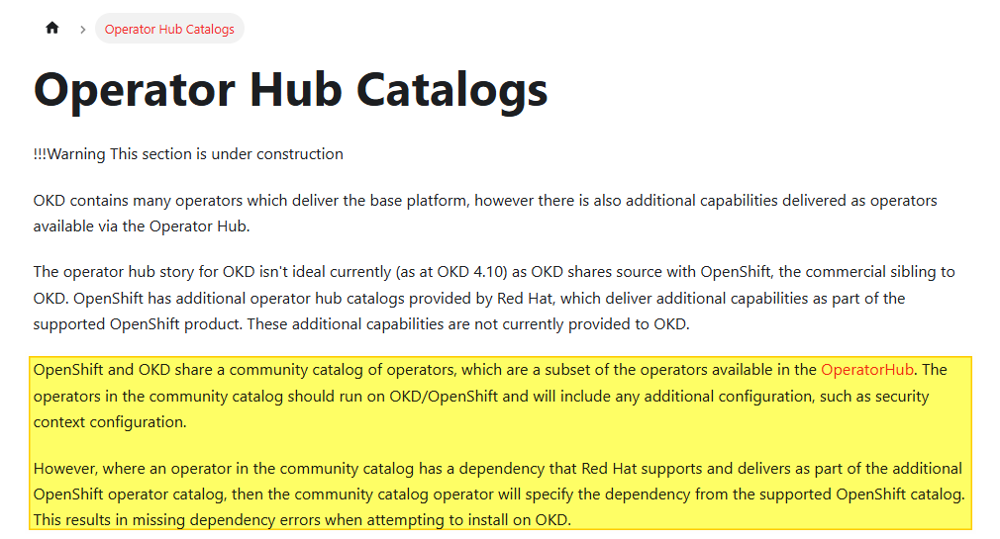

# Documentación de Ilba

## OKD

> **Filosofía principal:** *"Everything is an Operator"* — Equipo de Ingeniería de Red Hat.

### Recursos y Referencias
* Documentación de la Comunidad: [okd.io](https://okd.io)
* Documentación Oficial del Producto: [docs.okd.io](https://docs.okd.io)

---

### Índice de Contenidos

#### 1. Introducción y Comparativas
* :construction: [KubeSpray vs OKD](./OKD/KubeSpary-vs-OKD/README.md) *(En construcción)*

#### 2. Instalación y Gestión de Nodos
* [Instalación: UPI (User-Provisioned Infrastructure)](./OKD/Install-UPI/README.md)
* [Añadir nodo al clúster de OKD](./OKD/add_worker/README.md)

#### 3. Interfaz y Operaciones
* [Consola Web (GUI)](./OKD/GUI/README.md)
* [Insights](./OKD/insights/README.md)

#### 4. Almacenamiento
* [Configuración de vSphere CSI Driver](./OKD/CSI-vSphere/README.md)

#### 5. Redes (OVN-Kubernetes)
* :construction: [NetworkPolicies](./OKD/OVN-Kubernetes/NetworkPolicy/README.md) *(En construcción)*
* [Egress IP Address](./OKD/OVN-Kubernetes/egressIPaddress/README.md)
